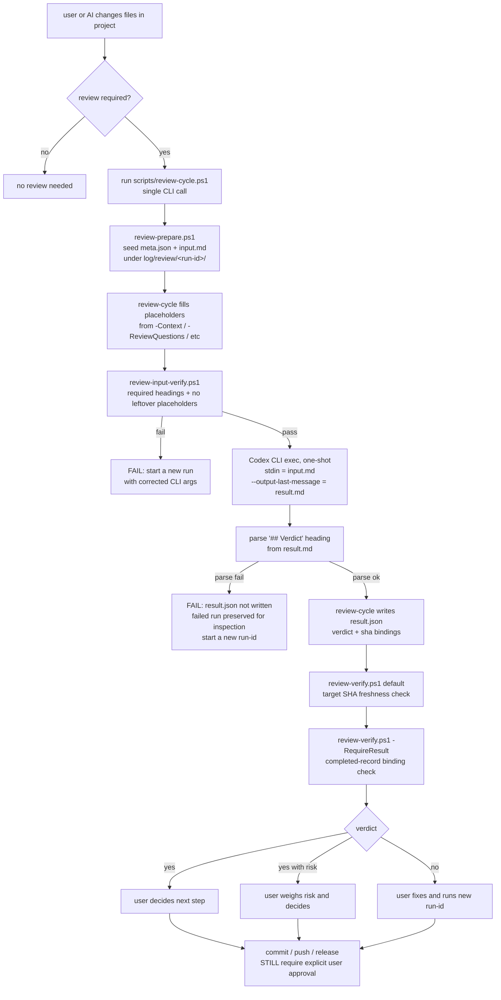
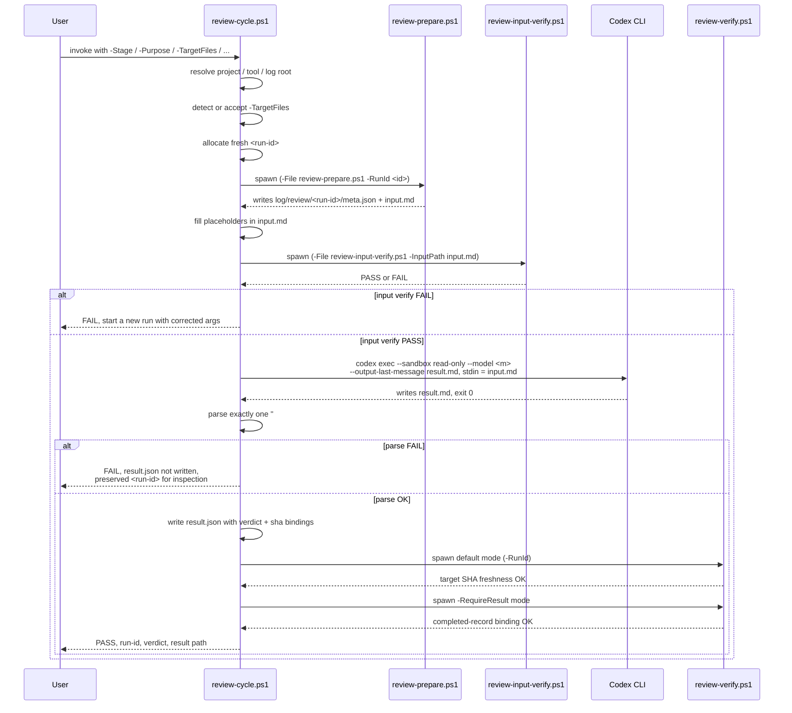

# Operator Guide (Korean)

> **현행 adoption 모델 안내.** 현재 adoption / default 방향은 **shared / global stable runtime ToolRoot** — channel 3, 즉 `%USERPROFILE%\.claude\ai-harness-toolset\current` 의 global stable install 이며 invocation 마다 resolve 된다. 본 guide 의 live 절차는 이 shared / global model 기준으로 정합화되어 있다. `.ai-harness/` project-local copy mode 절차는 **legacy project-local copy mode (channel 5)** 로 명확히 한정되어 남아 있다 — backward compatibility 로 계속 지원되지만 신규 프로젝트의 권장 adoption 형태는 아니다. 현행 모델의 source-of-truth 는 `docs/roadmap/SHARED_GLOBAL_INVOCATION_CONTRACT.md`, `docs/roadmap/GLOBAL_INSTALL_UPDATE_MODEL.md`, 그리고 `README.md` 상단의 current adoption pointer 다.

이 문서는 `ai-harness-toolset` 의 **current / latest operator guide** 다 — 사용자 관점에서 toolset 을 운용하고 평가하기 위한 operator-facing 가이드다. 현행 shared / global 운용 절차를 본문 live 절차로 담고, MVP acceptance 절차는 §13–§16 의 acceptance section 으로 유지한다 (문서 전체 identity 는 MVP 전용이 아니다 — 이 파일은 `docs/MVP_OPERATOR_GUIDE_KR.md` 에서 `docs/OPERATOR_GUIDE_KR.md` 로 rename 되었다).

대상 독자는 이 toolset 을 Claude Code 중심 워크플로에서 운용하려는 사용자다. 내부 개발자 문서가 아니다. 현행 adoption 은 shared / global stable runtime ToolRoot (channel 3) 이며, 일상 진입점은 §7 의 Claude Code 자연어 UX 다. raw PowerShell 명령은 §9 의 fallback / debug / reference 용이다. 자세한 contract / policy / migration 은 `docs/` 의 다른 파일을 참고한다.

설명은 한국어, 경로 / 파일명 / 스크립트명 / 명령어 / config key / verdict 문자열 등 식별자는 영문 그대로 둔다.

---

## 1. MVP 의 의미

이 repo 의 MVP 는 다음을 만족하는 상태를 가리킨다.

- toolset 의 lifecycle script 가 `<ToolRoot>` (현행 default: channel 3 global stable install) 에서 실행되면서, runtime artifact 는 `<ProjectRoot>` 의 `log/` 아래에만 생성된다.
- 사용자가 단일 review cycle 호출 (`review-cycle.ps1`) 으로 review packet 준비 → input 검증 → Codex CLI 1회 실행 → verdict parsing → result 기록 → freshness / binding 검증을 모두 수행한다.
- 결과는 `<project-root>/log/review/<run-id>/` 아래 read-only 파일로 보존된다.
- 자동 commit / push / release 는 하지 않는다. verdict 는 사용자 판단 input 일 뿐 자동 게이트가 아니다.

MVP 는 productization 이 아니다. installer, watcher, hook, daemon, auto-fix loop, retention automation 은 명시적으로 out-of-scope 이다 (`docs/AI_HARNESS_TOOLSET_SCOPE.md`).

---

## 2. ToolRoot / ProjectRoot 와 운용 모드

이 toolset 은 `<ToolRoot>` (lifecycle script / config / templates / snippets 가 사는 위치) 와 `<ProjectRoot>` (작업 대상 repo, runtime artifact 가 `log/` 아래 생기는 위치) 를 분리한다. `<ToolRoot>` 는 invocation 마다 channel chain 으로 resolve 된다 (`docs/roadmap/SHARED_GLOBAL_INVOCATION_CONTRACT.md`).

| 모드 | 의미 | `<ToolRoot>` | 위상 |
|---|---|---|---|
| shared / global | global stable install 을 모든 프로젝트가 공유 | `%USERPROFILE%\.claude\ai-harness-toolset\current` (channel 3) | **현행 default** |
| source-repo / dogfooding | `ai-harness-toolset` repo 자체에서 직접 사용 | `<repo-root>/` — channel 4 (multi-marker) 는 channel 3 이 부재할 때만 도달하므로, global stable install 이 있는 환경에서는 explicit `-ToolRoot <repo-root>` (channel 1) 로 지정 | source repo 운영자용 |
| legacy project-local copy | target 안에 payload 사본을 둔 경우 | `<project-root>/.ai-harness/` (channel 5) | legacy / backward compatibility (§3, §9 의 legacy 절) |

세 모드는 `<ToolRoot>` 가 어디로 resolve 되는지만 다르고 동작 contract 는 같다. channel resolution 순서는 channel 1 (`-ToolRoot`) → channel 2 (`AI_HARNESS_TOOL_ROOT` env) → channel 3 (global stable install) → channel 4 (dogfooding multi-marker) → channel 5 (legacy `.ai-harness/`) 다 (`docs/roadmap/SHARED_GLOBAL_INVOCATION_CONTRACT.md`). 현행 default 인 shared / global 모드에서는 사용자가 `-ToolRoot` 인자나 `AI_HARNESS_TOOL_ROOT` 환경변수를 지정하지 않아도 channel 3 이 자동 resolve 된다. **channel 3 이 channel 4 보다 앞서므로**, source repo 운영자가 global stable install 이 materialize 된 환경에서 dogfooding 하려면 explicit `-ToolRoot` 로 repo root 를 지정해야 channel 3 이 channel 4 를 가리지 않는다. 일상 운용에서는 §7 의 Claude Code 자연어 UX 가 진입점이고, 사용자가 ToolRoot 경로를 직접 다룰 일은 없다.

source repo 의 `docs/`, `tests/`, `log/` 는 어떤 모드에서도 `<ProjectRoot>` 로 복사되지 않는다. `docs/*.md` 가 필요하면 source repo (또는 resolved ToolRoot) 쪽 파일을 본다.

---

## 3. (Legacy) `.ai-harness/` project-local copy mode payload 구조

> **legacy project-local copy mode only.** 본 절은 channel 5 — legacy project-local copy mode — 에만 적용된다. 현행 default 인 shared / global 모드 (§2) 에서는 target project 안에 source payload 를 복사하지 않는다. 신규 프로젝트는 본 절의 절차를 쓰지 않는다.

legacy project-local copy mode 를 쓰는 경우에 한해, target project 에 복사하는 4개 폴더는 다음과 같다. 그 외 항목은 복사하지 않는다.

| Source path | Target path |
|---|---|
| `config/` | `<project-root>/.ai-harness/config/` |
| `scripts/` | `<project-root>/.ai-harness/scripts/` |
| `snippets/` | `<project-root>/.ai-harness/snippets/` |
| `templates/` | `<project-root>/.ai-harness/templates/` |

규칙 (legacy mode):

- `docs/`, `tests/`, `log/`, `README.md`, `.gitattributes` 등은 복사하지 않는다.
- `.ai-harness/` 디렉터리만 지우면 그 project-local deployment 가 사라진다.
- 글로벌 `CLAUDE.md` / `AGENTS.md` 는 어떤 모드에서도 implicit / automatic 으로 변경되지 않는다. (explicit user-approved managed-block replacement 는 별도 governed scope 다 — `docs/roadmap/GLOBAL_ADOPTION_DECISION.md` §6.)

`snippets/` 는 root 의 `CLAUDE.md` / `AGENTS.md` 에 사용자가 의도적으로 managed block 형태로 붙여 넣는 영문 payload 다. 자동 주입은 하지 않는다 (`README.md` 의 Snippets 절 참조).

---

## 4. `log/` runtime output 구조

runtime artifact 는 항상 `<project-root>/log/` 아래에만 생성된다.

```
<project-root>/log/
├── chatlog/   # 세션 작업 로그 (docs/CHATLOG_CONTRACT.md)
├── evidence/  # 명령 / 테스트 / 실행 사실 (docs/EVIDENCE_CONTRACT.md)
└── review/    # review packet 과 review record (docs/REVIEW_RESULT_CONTRACT.md)
    └── <run-id>/
        ├── meta.json
        ├── input.md
        ├── result.md
        └── result.json
```

- `log/` 는 runtime artifact tree 다. 절대 commit 하지 않는다.
- target project 의 `.gitignore` 에 `log/` 가 들어가 있는지 사용자가 직접 확인한다. toolset 은 target 의 `.gitignore` 를 만들지 않는다.
- review record 의 retention 단위는 `<run-id>` 디렉터리 전체다. 사용자가 손으로 지운다. 자동 prune / rotate 는 없다.

`scripts/log-init.ps1` 을 한 번 실행하면 `log/`, `log/chatlog/`, `log/evidence/`, `log/review/` 4개 디렉터리가 생성된다.

---

## 5. 전체 pipeline diagram



핵심 포인트:

- 한 번의 사용자 호출 = 한 번의 Codex 실행. retry / fallback model / auto-fix loop 없음.
- verdict 가 `yes` 여도 commit / push / publish / merge / release 자동 트리거 없음.
- parsing 실패한 run 은 디스크에 그대로 남는다. 사람이 같은 run-id 안의 파일을 손으로 보정하지 않고, 새 run-id 로 다시 만든다.
- 본 절과 §6 의 diagram 은 review cycle 의 흐름을 mode-neutral 하게 기술한다. diagram 안의 `scripts/<name>.ps1` 는 script 이름이며, 실제 `<ToolRoot>` 위치 (현행 default: channel 3 global stable install) 는 §2 의 channel resolution 으로 결정된다 — shared / global, source-repo / dogfooding, legacy project-local copy 어느 모드에서도 흐름 자체는 동일하다.

---

## 6. `review-cycle.ps1` sequence diagram



`Codex CLI` 인자는 `--ask-for-approval never`, `--sandbox read-only`, `--output-last-message <result.md>`, `-c web_search=disabled`, `--model <model>` 로 호출된다 (`scripts/review-cycle.ps1` 의 `Invoke-CodexExec` 참조).

---

## 7. 일상 운용 UX 는 Claude Code CLI 자연어 의도다

`ai-harness-toolset` 의 일상 운용 진입점은 사용자가 Claude Code CLI 안에서 한국어 또는 영문으로 자연어 의도를 표현하는 것이다. 사용자는 일반적으로 raw PowerShell 명령을 직접 입력하지 않는다.

| 사용자 발화 (예시) | TargetFiles 모드 | Claude Code 가 수행하는 동작 |
|---|---|---|
| `현재 진행한 작업 코덱스 리뷰 진행해` | Mode A — changed files | git status / diff 확인 → 변경된 tracked 파일을 TargetFiles 로 결정 → review-cycle.ps1 인자 합성 → 1회 실행 → result.md / result.json 확인 → review-verify -RequireResult 확인 → yes / no / yes with risk 보고. 변경 파일이 0 개면 중단 (Mode B 로 자동 전환하지 않음). |
| `현재 구현된 서버의 소켓 라이브러리를 니가 직접 리뷰하고, 그후에 코덱스 리뷰로 한번 더 리뷰후 최종 결론 도출해` | Mode B — tracked subsystem files | 호명된 subsystem 의 tracked 파일을 (현재 변경 여부와 무관하게) TargetFiles 로 결정 → Claude 자체 리뷰 1회 → 위와 같은 코덱스 cycle 1회 → 두 결과를 병합하여 단일 최종 verdict 도출. |

Mode 선택 규칙은 SKILL.md step 2 에 명시되어 있다. subsystem 명이 너무 넓거나 매칭되는 파일이 없을 때만 Claude 가 1회 clarification 을 묻고, 그 외에는 자율로 진행한다. 어느 mode 에서도 review-cycle.ps1 은 정확히 1회만 실행되고, commit / push 는 하지 않는다.

이 자연어 UX 의 명세는 optional skill template `snippets/claude-skills/ai-harness-review/SKILL.md` 에 정의되어 있다. 아래 8 절을 참고한다.

8 절 이후의 raw PowerShell 명령은 다음 용도로만 사용한다.

- fallback (skill / Claude Code 가 없는 환경, 또는 비활성 상태)
- debug (특정 인자 조합을 직접 검증해야 할 때)
- 참고 reference (skill 이 내부적으로 합성하는 인자 형태를 사람이 읽기 위해)

raw 명령을 그대로 외워서 매번 입력하는 것은 권장하지 않는다.

---

## 7b. BF save / restore-offer 자연어 UX (현재 snippet protocol)

> **Note — source snippet alignment.** 본 절의 BF save / restore-offer protocol description 은 현재 `snippets/CLAUDE_SNIPPET.md` / `snippets/AGENTS_SNIPPET.md` 와 정합화되어 있고, `docs/BRIEF_CONTRACT.md` / `docs/CHATLOG_CONTRACT.md` 의 corrected framing 을 그대로 따른다. 즉 두 source snippet 은 본 라운드에서 갱신되어 더 이상 옛 모델 ("`log/brief/BRIEF.md` 가 canonical BRIEF", "`log/chatlog/current/resume.md` / `summary.md` 가 canonical BF Level 1/2", "root `<ProjectRoot>/brief/` 는 forbidden") 을 담지 않는다. **단, 운영자가 이전에 destination `CLAUDE.md` / `AGENTS.md` 의 managed block 에 적용한 snippet 본문은 explicit refresh 단계를 거치기 전까지는 옛 모델로 남아 있다** — 그 refresh 는 사용자가 명시 승인하는 별도 managed-block replacement step 이며 (`docs/roadmap/GLOBAL_ADOPTION_DECISION.md` §6), ai-harness 는 그 적용을 자동으로 수행하지 않는다. 본 가이드 / contract docs 와 실제로 적용된 managed block 본문 사이에 framing 이 충돌하면, 운영자가 destination 의 managed block 을 refresh 할 때까지 **현행 contract docs (`docs/BRIEF_CONTRACT.md`, `docs/CHATLOG_CONTRACT.md`) 의 framing 이 우선** 한다.

`ai-harness-toolset` 의 일상 운용에서 사용자는 raw PowerShell 명령을 직접 입력하지 않고, Claude Code 안에서 자연어 의도를 표현한다. 채택된 snippet 이 활성화되어 있으면 Claude Code 는 그 protocol 에 따라 Brief artifact 를 갱신한다.

### BF 저장 (사용자 발화)

다음 형태의 사용자 발화는 모두 BF 저장 / checkpoint 의도로 해석된다.

```text
현재 진행 지점을 복구 시점으로 저장해
BF 저장해
복구 지점 저장해
handoff 지점 만들어줘
다음 세션에서 이어갈 수 있게 정리해
현재 phase checkpoint 남겨줘
```

이 의도가 감지되면 Claude Code 는 현재 source snippet protocol (BF Level 1/2 manual save discipline) 에 따라 다음 절차를 수행한다.

1. repo 상태 확인 (`pwd`, git top-level, branch, HEAD, origin/main, status).
2. 현재 상태 / 마지막 완료 action / 다음 단일 action / do-not-do / pending user decision 을 정리.
3. `<project-root>/brief/BRIEF.md` (target product canonical Brief) 를 manual save 로 직접 갱신. `docs/BRIEF_CONTRACT.md` 의 canonical heading set 을 그대로 사용.
4. 관련 review / evidence / Chatlog artifact 는 path / link 로만 참조 — 본문 인라인 금지.
5. Brief 는 짧게 유지. 상세 내용이 필요하면 path 만 가리킨다.
6. `log/chatlog/current/resume.md` / `summary.md` 자리는 **갱신하지 않는다** (legacy / deprecation candidate; `docs/CHATLOG_CONTRACT.md`).
7. 갱신된 파일과 남은 risk 를 사용자에게 보고.

이 절차에서 Claude Code 는 사용자가 어떤 raw PowerShell 명령도 직접 입력하지 않도록 한다. 사용자가 명시적으로 "직접 PowerShell 로 갱신하겠다" 라고 의사를 밝히지 않는 한 자연어 발화 한 줄로 BF 저장이 완료되어야 한다.

### 새 Claude Code 세션 진입 시 — restore-offer (manual discipline)

사용자가 같은 프로젝트에서 새 Claude Code 세션을 열면 manual restore-offer discipline 은 다음과 같다. 본 흐름은 채택된 snippet 에 의존하며, deterministic restore-offer automation (BF Level 3) 은 미구현이다.

1. Claude Code 가 snippet 의 read order 에 따라 Brief 존재 여부를 확인한다.
   - 1순위: `<project-root>/brief/BRIEF.md` (target product canonical Brief; `docs/BRIEF_CONTRACT.md`).
   - 2순위 (fallback): `<project-root>/log/brief/BRIEF.md` (`scripts/brief-init.ps1` 의 seed destination; operator-local runtime artifact 이며 canonical 자리는 아님).
2. 어떤 자리에서든 Brief 가 읽히면 그 파일을 기준으로 한국어로 현재 상태 / 다음 단일 action / do-not-do / pending user decision 을 요약 보고.
3. 사용자에게 `이 복구 지점에서 이어서 진행할까요?` 라고 묻는다.
4. 사용자 확인 전에는 의미 있는 작업을 실행하지 않는다.

두 자리 모두 Brief 가 없으면 **Chatlog 로 default-restore 하지 않는다.** raw transcript / 누적 Chatlog 본문을 읽어 Brief 를 임의로 재구성하지 않고, Brief 부재를 사용자에게 보고한 뒤 다음 행동을 묻는다. 사용자가 명시적으로 Chatlog 로부터의 reconstruction 을 요청한 경우에 한해, Chatlog 를 evidence 로 다루고 사용자가 검토할 Brief draft 를 만들어 제출한다 — Brief 자리를 단정적으로 채우지 않는다.

### BF Level 의 의미와 자동화 경계

BF Level 은 path 가 아니라 **save / restore capability maturity** 다 (`docs/BRIEF_CONTRACT.md`).

- BF Level 1/2 — manual save / restore discipline. operator (또는 operator role 의 agent) 가 protocol 을 따라 BRIEF 를 사람이 읽기 좋은 형태로 직접 작성 / 갱신하고, 새 session 진입 시 그 자리를 다시 읽어 작업을 복원한다. snippet protocol 의 BF save / restore-offer 흐름이 그 한 형태다.
- BF Level 3 — deterministic Brief maintenance / validation / stale warning / session-start guidance / restore-offer 의 자동화. **현재 미구현** 이며 future scoped work 다. 본 가이드 범위 밖이다.

본 가이드 / 본 MVP 가 도입하지 않는 것:

- hook, session-start automation, on-stop hook, on-prompt-submit hook, watcher, daemon, scheduler.
- 사용자 prompt 자동 capture, assistant 응답 자동 capture, transcript JSONL parser, `BF_STATE.json` 같은 별도 state machine.
- `~/.claude/settings.json` 또는 글로벌 `CLAUDE.md` / `AGENTS.md` 의 implicit / automatic mutation. 모든 snippet payload 는 사용자가 명시적으로 채택한 경우에만 활성화된다.
- Chatlog fuller implementation — 누적 work history 자동화, 자체 schema, retention, browse UI, RND-style heavy workflow — 는 본 가이드 범위 밖이며 later track 이다 (`docs/CHATLOG_CONTRACT.md`).
- 현재 snippet protocol 의 writer destination 을 target canonical (`brief/BRIEF.md`) 로 routing 하는 변경. 별도 scoped 승인이 필요한 future scoped work.

위 7b 본문의 UX 는 source `snippets/CLAUDE_SNIPPET.md` / `snippets/AGENTS_SNIPPET.md` 의 protocol 과 substance 가 동일하다. 두 자리의 framing 은 본 라운드 기준 정합화되어 있고, 어느 한쪽이 변경되면 다른 쪽도 같은 source-of-truth (`docs/BRIEF_CONTRACT.md`, `docs/CHATLOG_CONTRACT.md`) 를 기준으로 함께 갱신되어야 contract drift 가 발생하지 않는다. 운영자가 이전에 destination `CLAUDE.md` / `AGENTS.md` 의 managed block 에 적용한 본문이 옛 모델 그대로라면 그 managed block 의 explicit refresh 가 별도 단계로 필요하다 (위 절두 note 참조).

---

## 8. Optional skill adoption path

`snippets/claude-skills/ai-harness-review/SKILL.md` 는 자동 주입되지 않는 optional payload 다. 다른 snippet 들과 마찬가지로 사용자가 의도적으로 채택한다.

채택 위치는 둘 중 하나다. 둘 다 사용자가 직접 복사한다.

| 위치 | 의미 |
|---|---|
| `<project-root>/.claude/skills/ai-harness-review/SKILL.md` | 이 프로젝트에서만 활성. 권장 (project-local 원칙과 일치) |
| `~/.claude/skills/ai-harness-review/SKILL.md` | 모든 프로젝트에서 활성. 글로벌 적용을 명시적으로 원할 때만 사용 |

채택 규칙:

- 자동 install 없음. ai-harness-toolset 은 사용자 동의 없이 `~/.claude/` 또는 `.claude/` 를 만들지 않는다.
- 복사 단위는 `SKILL.md` 한 파일이다. 폴더 이름 `ai-harness-review` 는 그대로 둔다 (Claude Code 가 폴더 이름으로 skill 을 식별한다).
- 업데이트는 source repo 의 `snippets/claude-skills/ai-harness-review/SKILL.md` 를 다시 복사하는 식이다. in-place 수정한 사본은 다음 복사 시 덮어 쓰여진다.
- 제거는 채택한 위치의 `ai-harness-review/` 디렉터리를 지우는 것이다. 그 외 글로벌 상태는 변경되지 않는다.

skill 이 적용된 후의 트리거는 자연어 의도다. `/skill ai-harness-review` 같은 슬래시 명령 형태를 강제하지 않는다. 위 7 절의 두 발화 예시가 그대로 트리거다.

skill 이 채택되어 있지 않은 환경에서도 toolset 자체는 동작한다. 그 경우 사용자는 9 절 이후의 raw PowerShell 명령을 직접 사용한다.

---

## 9. Operator command quickstart (fallback / debug / reference)

이 절의 명령은 일상 운용용이 아니라, 위 7-8 절의 자연어 UX 가 사용 불가능하거나 인자 조합을 직접 디버그해야 할 때를 위한 fallback / reference 다.

### shared / global 모드 (현행 default)

target project 의 root 디렉터리 안에서 실행한다고 가정한다. channel 3 global stable install (`%USERPROFILE%\.claude\ai-harness-toolset\current`) 이 materialize 되어 있으면 `-ToolRoot` / `AI_HARNESS_TOOL_ROOT` 없이 channel 3 이 자동 resolve 되고, ProjectRoot 는 CWD 로 잡힌다. global stable install 의 materialize / update 자체는 `docs/roadmap/GLOBAL_INSTALL_UPDATE_MODEL.md` 의 install / update 모델을 따른다.

```powershell
# 1. log tree 초기화 (한 번, target project 안에서)
powershell -NoProfile -ExecutionPolicy Bypass `
    -File "$env:USERPROFILE\.claude\ai-harness-toolset\current\scripts\log-init.ps1"

# 2. <project-root>/.gitignore 에 log/ 포함 확인 (사용자 책임)

# 3. 단일 파일 review cycle 실행
powershell -NoProfile -ExecutionPolicy Bypass `
    -File "$env:USERPROFILE\.claude\ai-harness-toolset\current\scripts\review-cycle.ps1" `
    -Stage implementation `
    -Purpose '<purpose>' `
    -TargetFiles <single-relative-file> `
    -Context '<context>' `
    -RequiredInspectionPaths '<paths>' `
    -ReviewQuestions '<questions>' `
    -Constraints '<constraints>'

# 4. 다중 파일 review cycle 실행 — 라인당 한 경로씩 list 파일을 만들고 -TargetFilesPath 로 넘긴다.
#    list 파일은 반드시 <project-root>/log/ 아래에 둔다.
New-Item -ItemType Directory -Force -Path log/review-targets | Out-Null
@'
relative/path/one.ps1
relative/path/two.md
'@ | Out-File -FilePath log/review-targets/example.list -Encoding utf8

powershell -NoProfile -ExecutionPolicy Bypass `
    -File "$env:USERPROFILE\.claude\ai-harness-toolset\current\scripts\review-cycle.ps1" `
    -Stage implementation `
    -Purpose '<purpose>' `
    -TargetFilesPath log/review-targets/example.list `
    -Context '<context>' `
    -RequiredInspectionPaths '<paths>' `
    -ReviewQuestions '<questions>' `
    -Constraints '<constraints>'
```

### source repo 모드 (dogfooding)

`ai-harness-toolset` source repo 자체 안에서 실행하는 경우다. source repo 운영자용이며, target 소비자는 쓰지 않는다. channel 4 (dogfooding multi-marker) 는 channel 3 (global stable install) 이 부재할 때만 도달하므로, global stable install 이 materialize 된 환경에서 source repo 를 ToolRoot 로 쓰려면 explicit `-ToolRoot` (channel 1) 로 repo root 를 지정한다 — 그래야 channel 3 이 channel 4 를 가리지 않는다.

```powershell
# log tree 초기화 (log-init.ps1 은 ToolRoot 를 쓰지 않는다) 후, repo root 안에서
# 단일 review cycle 실행. -ToolRoot 로 repo root 를 명시해 channel 3 global stable
# install 유무와 무관하게 결정적으로 dogfooding 한다.
powershell -NoProfile -ExecutionPolicy Bypass -File scripts/log-init.ps1
powershell -NoProfile -ExecutionPolicy Bypass -File scripts/review-cycle.ps1 `
    -ToolRoot (Get-Location).Path `
    -Stage implementation `
    -Purpose 'review change to scripts/review-cycle.ps1' `
    -TargetFiles scripts/review-cycle.ps1 `
    -Context '<short context for reviewer>' `
    -RequiredInspectionPaths 'scripts/review-cycle.ps1' `
    -ReviewQuestions '<one or more concrete questions>' `
    -Constraints '<explicit constraints>'
```

### (Legacy) project-local copy mode

> **legacy project-local copy mode only.** 본 절은 channel 5 에만 적용된다. 현행 default 인 shared / global 모드는 위 절을 쓴다. 신규 프로젝트는 본 절을 쓰지 않는다.

§3 의 legacy 절차로 `.ai-harness/` payload 를 복사해 둔 경우, 스크립트 경로만 `<project-root>/.ai-harness/scripts/<name>.ps1` 로 바뀌고 인자 contract 는 위 shared / global 예시와 동일하다.

```powershell
# payload 복사 (config/, scripts/, snippets/, templates/ -> <project-root>/.ai-harness/) 후
powershell -NoProfile -ExecutionPolicy Bypass -File .ai-harness/scripts/log-init.ps1
powershell -NoProfile -ExecutionPolicy Bypass -File .ai-harness/scripts/review-cycle.ps1 `
    -Stage implementation `
    -Purpose '<purpose>' `
    -TargetFiles <single-relative-file> `
    -Context '<context>' `
    -RequiredInspectionPaths '<paths>' `
    -ReviewQuestions '<questions>' `
    -Constraints '<constraints>'
```

`-TargetFiles` 를 생략하면 git status 의 tracked 변경 파일이 자동 사용된다. untracked 파일이 있으면 실패한다. 결정적 동작이 필요하면 `-TargetFiles` (단일 파일) 또는 `-TargetFilesPath` (다중 파일 list) 를 명시한다.

prepare 가 성공하면 입력 파일 목록은 `log/review/<run-id>/target-files.list` 에 informational snapshot 으로 보존된다. 따라서 외부 입력 `log/review-targets/<slug>.list` 는 prepare 직후 안전하게 삭제할 수 있고, 보존해도 무해하다. snapshot 은 freshness 검증 대상이 아니며 권위 source-of-truth 는 여전히 `meta.json.targetFiles[]` 다.

다중 파일 review 의 정식 입력 shape 은 `-TargetFilesPath` 다. 콤마로 결합된 단일 `-TargetFiles "a.txt,b.txt"` 값은 `review-cycle.ps1` 가 reviewer 호출 전에 거부한다 (`FAIL TargetFiles appears to be a comma-separated single string`). `-TargetFiles` 는 단일 파일만 지정하는 인자이며, 콤마를 포함하는 실제 단일 파일명 (예: `docs/a,b.md`) 은 그대로 허용된다. `review-cycle.ps1` 가 0 이 아닌 코드로 종료되면 자동 재실행하지 않는다. wrapper failure 를 보고하고 별도 scoped 승인을 받은 뒤에만 다시 실행한다. retry discipline 의 정식 출처는 `snippets/claude-skills/ai-harness-review/SKILL.md` 다.

PowerShell 에서 위 here-string 을 `Out-File -Encoding utf8` 로 쓰면 PS 5.1 에서는 기본적으로 BOM 이 붙는다. `review-cycle.ps1` 는 BOM 유무와 무관하게 list 파일을 읽는다. 더 엄격히 BOM 없이 만들고 싶으면 PS 7 이상에서 `-Encoding utf8NoBOM` 을 쓰거나, `[System.IO.File]::WriteAllText($path, $text, (New-Object System.Text.UTF8Encoding($false)))` 를 직접 사용한다.

---

## 9a. 이미 준비된 run-id 에 대해 reviewer 만 실행하는 경우

`scripts/review-run.ps1` 은 이미 prepare 된 `log/review/<run-id>/` 에 대해 reviewer 만 실행하는 보조 경로다. 일반 운용은 `scripts/review-cycle.ps1` 한 번으로 끝나므로, 다음과 같은 좁은 상황에서만 사용한다.

- prepare 와 input.md 채움까지는 별도로 완료해 둔 상태에서 reviewer 만 다시 실행하고 싶을 때.
- `scripts/review-prepare.ps1` 로 `<run-id>` 를 만들고 input.md 를 직접 편집한 뒤 reviewer 호출만 분리해서 수행하고 싶을 때.

소스 repo 모드 예시:

```powershell
# 1. 이미 prepare + input.md 채움이 끝난 <run-id> 가 있다고 가정.
powershell -NoProfile -ExecutionPolicy Bypass -File scripts/review-run.ps1 -RunId <run-id>

# 2. 이전 reviewer 실행 결과를 명시적으로 덮어쓰며 재실행.
powershell -NoProfile -ExecutionPolicy Bypass -File scripts/review-run.ps1 -RunId <run-id> -Force
```

shared / global 모드에서는 §9 의 channel 3 경로 (`$env:USERPROFILE\.claude\ai-harness-toolset\current\scripts\review-run.ps1`) 를, legacy project-local copy mode 에서는 `.ai-harness/scripts/review-run.ps1` 을 같은 인자로 실행한다. source repo 모드에서는 `scripts/review-run.ps1` 을 직접 실행한다.

동작 contract (요약):

- `review-run.ps1` 은 reviewer 실행 직전에 `review-input-verify.ps1` 을 내부적으로 호출한다. 사용자가 별도로 먼저 실행할 필요는 없다. 사용자가 미리 수동으로 `review-input-verify.ps1 -InputPath <run-id>/input.md` 를 실행해도 무방하다.
- `review-input-verify` 가 실패하면 (placeholder 잔존, heading 누락, `{{TOKEN}}` 잔존 등) `review-run` 은 Codex 를 호출하지 않고 FAIL 하며 `result.md` / `result.json` 을 만들지 않는다.
- `review-run` 은 새 `<run-id>` 를 만들지 않는다. 기존 prepare 된 `<run-id>` 위에서만 동작하며 존재하지 않으면 FAIL.
- `meta.json` 과 `input.md` 는 mutate 하지 않는다. write-once 원칙을 지킨다.
- `result.md` / `result.json` 이 이미 존재하면 기본적으로 FAIL 하며 사용자가 `-Force` 를 명시할 때에만 두 파일을 제거하고 재실행한다. 기존 verdict 무음 덮어쓰기는 없다.
- reviewer 실행 후 `review-verify.ps1` 의 default mode 와 `-RequireResult` mode 를 모두 호출하며 두 검증이 모두 PASS 일 때에만 `review-run: PASS` 로 종결한다.
- `log/chatlog/`, `log/evidence/`, source / target repo 의 글로벌 파일 (`~/.claude/`, root `CLAUDE.md`, root `AGENTS.md`) 은 어떤 경우에도 만들거나 수정하지 않는다.
- verdict (`yes` / `no` / `yes with risk`) 는 commit / push / publish / merge / release / deployment 를 자동 승인하지 않는다. 사용자가 별도로 결정하고 직접 실행한다.

`review-cycle.ps1` 과의 차이를 정리하면 다음과 같다.

| 항목 | `review-cycle.ps1` | `review-run.ps1` |
|---|---|---|
| 책임 | prepare + reviewer 실행 + verify 를 1회로 묶음 | 이미 prepare 된 `<run-id>` 에서 reviewer 실행 + verify 만 수행 |
| 새 `<run-id>` 생성 | 함 (없으면 자동 할당) | 안 함. 기존 prepared `<run-id>` 가 반드시 있어야 함 |
| `meta.json` 작성 | 함 (prepare 단계) | 안 함. 기존 값을 그대로 읽기만 함 |
| `input.md` 작성 / 치환 | 함 (placeholder 치환 포함) | 안 함. 사용자가 채운 그대로 사용 |
| `result.md` / `result.json` overwrite 정책 | 새 `<run-id>` 라 충돌 없음 | 이미 있으면 FAIL. `-Force` 명시 시에만 덮어씀 |
| BF / chatlog / evidence 영향 | 없음 | 없음 |

`review-run` 이 0 이 아닌 코드로 종료되면 자동 재실행하지 않는다. 실패 사유 (`review-input-verify` 실패, Codex 실패, verdict parse 실패, `review-verify` 실패) 를 보고하고, 보완 후 별도 scoped 승인을 받아 다시 실행한다. 같은 `<run-id>` 안의 file 을 사람이 직접 보정해 cycle 을 닫지 않는다 — 새 run-id 로 prepare 부터 다시 시작하는 것이 정식 복구 경로다.

---

## 10. review artifact 역할

`log/review/<run-id>/` 아래 4개 파일은 모두 generated read-only record 다. 사람이 손으로 수정하지 않는다.

| 파일 | 작성자 | 역할 |
|---|---|---|
| `meta.json` | `review-prepare.ps1` | run-id, target path, target SHA-256, source HEAD, stage, purpose, reviewer config, freshness policy. `targetFiles[]` 로 multi-file freshness binding 을 함께 기록한다. |
| `input.md` | `review-prepare.ps1` (template) + `review-cycle.ps1` (placeholder fill) | reviewer 가 보고 판단을 내리는 입력. `## Context`, `## Required inspection paths`, `## Review questions`, `## Constraints`, `## Final verdict` 5개 섹션이 채워져야 한다. |
| `result.md` | Codex CLI (`--output-last-message`) | reviewer 의 자유 형식 markdown 응답. 단, 정확히 1개의 `## Verdict` heading 과 그 다음 첫 비어있지 않은 줄에 `yes` / `no` / `yes with risk` 중 하나가 있어야 cycle 이 verdict 를 인정한다. |
| `result.json` | `review-cycle.ps1` (verdict parsing 성공 시) | machine-readable 최종 record. `verdict`, `runId`, `targetPath`, `targetSha256`, `inputSha256`, `resultMarkdownSha256`, `createdAtUtc`, `sourceHead`, `stage`, `purpose`, `reviewer`, `notes[]`, `schemaVersion`. |

전체 contract 는 `docs/REVIEW_RESULT_CONTRACT.md` 가 source-of-truth 다.

---

## 11. verdict handling

`result.md` 와 `result.json.verdict` 는 정확히 다음 세 값만 사용한다.

| verdict | 의미 | 사용자 행동 가이드 |
|---|---|---|
| `yes` | 검토 범위 내에서 진행 가능 | 다음 작업 단계로 이동. commit / push / release 는 여전히 별도 승인. |
| `yes with risk` | 진행 가능하나 명시된 risk 동반 | result.md 의 risk 항목을 읽고 사용자 본인이 risk 수용 여부를 판단. 자동 게이트 아님. |
| `no` | 검토 범위 내에서 진행 불가 | result.md 의 required changes / findings 를 사용자가 읽고 보정한 뒤, 새 `<run-id>` 로 다시 review-cycle 실행. |

parser 는 `Verdict: yes`, `Final verdict: yes`, prose 안의 verdict 등 inline 형태를 받지 않는다. 정확한 shape 만 통과한다.

---

## 12. commit / push / release 는 별도 승인이다

verdict 가 `yes` / `yes with risk` 라도 다음 작업은 자동으로 일어나지 않는다. 사용자가 직접 결정하고 직접 명령을 실행한다.

- `git commit`
- `git push`
- 어떤 형태의 publish, merge, release, deployment
- target project 의 글로벌 파일 변경

toolset 은 verdict 를 읽어서 git 동작이나 release 동작을 트리거하는 wrapper 를 제공하지 않는다 (`docs/REVIEW_RESULT_CONTRACT.md` 의 non-goals 절).

---

## 12b. Acceptance scenario 분리 — review 와 BF/chatlog 는 별도 평가 축

`ai-harness-toolset` 의 acceptance 는 단일 축이 아니다. 어떤 의도로 toolset 을 적용하느냐에 따라 기대되는 artifact 가 다르다. test repo 또는 dogfooding repo 에서 두 축을 혼동하면 잘못된 fail 판정을 내리기 쉽다.

기본 원칙:

- Pure review-loop acceptance 는 BF artifact 또는 Chatlog artifact 의 존재를 요구하지 않는다.
- BF / Chatlog artifact 는 BF save / closeout / handoff / restore-offer intent 가 명시적으로 scope 안에 있을 때에만 기대된다.
- pure review test repo 에서 `log/chatlog/` 가 비어 있는 것은 review subsystem 의 실패가 아니다.
- dogfooding target repo 라도, 채택한 snippet 또는 사용자 발화에 BF save / closeout 의도가 포함된 경우에만 source snippet protocol 이 `<ProjectRoot>/brief/BRIEF.md` (target product canonical Brief) 자리에 manual save 를 수행한다. `log/chatlog/current/resume.md` / `summary.md` 는 protocol 의 갱신 대상이 아니다 — legacy / deprecation candidate 분류 (`docs/CHATLOG_CONTRACT.md`).
- review artifact 와 BF / Chatlog artifact 는 서로 다른 평가 축이다. 한 축의 부재 또는 fail 로 다른 축을 fail 처리하지 않는다.

시나리오별 기대 artifact:

| Scenario | 기대 artifact |
|---|---|
| Pure review-loop acceptance | `log/review/<run-id>/input.md`, `result.md`, `result.json`, `meta.json` |
| BF save / closeout acceptance | `<ProjectRoot>/brief/BRIEF.md` (target product canonical Brief). source snippet protocol 의 갱신 대상도 이 자리이며, `log/chatlog/current/resume.md` / `summary.md` 는 갱신 대상이 아니다 (legacy / deprecation candidate, `docs/CHATLOG_CONTRACT.md`). |
| BF manual evidence acceptance | `log/evidence/<scope>/<case>/` |
| Source snapshot handoff | `snapshot.zip`, `manifest.json` (snapshot 내부에는 `log/` runtime artifact 를 포함하지 않는다) |

따라서 13 절의 checklist 는 review artifact 축만 점검한다. 같은 repo 에서 BF save / closeout 의도까지 dogfooding 하는 경우에만 `<ProjectRoot>/brief/BRIEF.md` 갱신을 별도 축으로 점검한다. 두 축의 fail 은 분리해서 보고한다.

BF Level 은 path 가 아니라 save / restore capability maturity 다 (`docs/BRIEF_CONTRACT.md`). BF Level 1/2 는 manual save / restore discipline 이고, BF Level 3 (deterministic Brief maintenance / validation / stale warning / session-start guidance / restore-offer) 는 미구현 future scoped work 다. daemon / watcher / scheduler / parser / `BF_STATE.json` 같은 자동화는 본 가이드 범위 밖이다 (7b 절).

---

## 13. Acceptance checklist (shared / global 모드)

테스트 프로젝트에서 다음 항목을 실제로 실행하고, 모두 직접 확인되면 운용 가능 상태로 본다. 본 checklist 는 현행 default 인 shared / global 모드 기준이다. legacy project-local copy mode 의 checklist 는 §13a 부록을 본다.

```text
[ ] channel 3 global stable install (%USERPROFILE%\.claude\ai-harness-toolset\current) 이 존재하고 lifecycle script 를 보유한다.
[ ] target project 의 .gitignore 에 log/ 가 포함되어 있다.
[ ] target project 안에서 log-init.ps1 (channel 3 경로) 실행 후 log/{chatlog,evidence,review}/ 가 생성된다.
[ ] review-cycle.ps1 한 번 호출만으로 한 cycle 이 끝난다 (ToolRoot 는 channel 3 으로 자동 resolve).
[ ] runtime artifact 가 ProjectRoot 의 log/ 아래에만 생성되고, ToolRoot (channel 3 payload) 는 변경되지 않는다.
[ ] log/review/<run-id>/ 아래 meta.json, input.md, result.md, result.json 4개가 모두 생긴다.
[ ] result.json.verdict 가 yes / no / yes with risk 중 정확히 하나다.
[ ] result.json.targetSha256 와 현재 target file SHA-256 이 일치한다 (review-verify default mode PASS).
[ ] result.json.inputSha256, resultMarkdownSha256 binding 이 review-verify -RequireResult mode 에서 PASS 한다.
[ ] verdict 가 yes 여도 toolset 이 commit / push / merge / release 를 자동으로 시도하지 않는다.
[ ] parsing 실패 / Codex 실패 시 그 <run-id> 가 디스크에 보존된다 (자동 삭제 없음).
[ ] global CLAUDE.md / AGENTS.md 가 implicit / automatic 으로 변경되지 않았다.
```

### 13a. (Legacy) project-local copy mode acceptance checklist 부록

legacy project-local copy mode (channel 5) 를 평가하는 경우에만 본 부록을 쓴다. 현행 default 평가에는 사용하지 않는다.

```text
[ ] target project 에 .ai-harness/ payload 4개 폴더만 복사했다.
[ ] target project 의 .gitignore 에 log/ 가 포함되어 있다.
[ ] .ai-harness/scripts/log-init.ps1 실행 후 log/{chatlog,evidence,review}/ 가 생성된다.
[ ] .ai-harness/scripts/review-cycle.ps1 한 번 호출만으로 한 cycle 이 끝난다.
[ ] log/review/<run-id>/ 아래 meta.json, input.md, result.md, result.json 4개가 모두 생긴다.
[ ] verdict / freshness / binding 검증 항목은 위 shared / global checklist 와 동일하다.
```

---

## 14. test project 에서 직접 평가하는 방법

추천 흐름 (shared / global 모드):

1. 임시 git repo 1개를 만든다 (예: `H:/tmp/ai-harness-trial/`).
2. channel 3 global stable install 이 `%USERPROFILE%\.claude\ai-harness-toolset\current` 에 materialize 되어 있는지 확인한다 (없으면 `docs/roadmap/GLOBAL_INSTALL_UPDATE_MODEL.md` 의 install 모델에 따라 준비).
3. test repo 의 `.gitignore` 에 `log/` 한 줄을 추가한다.
4. test repo 안에서 channel 3 의 `log-init.ps1` 을 실행한다 (§9 의 shared / global 예시).
5. test repo 안의 임의 파일 1개에 사소한 변경을 만든다 (예: README.md 한 줄 추가).
6. test repo 안에서 channel 3 의 `review-cycle.ps1` 을 §9 예시처럼 실행한다.
7. `log/review/<run-id>/` 안의 4개 파일을 직접 열어 본다.
8. 위 §13 checklist 를 한 줄씩 직접 체크한다. legacy project-local copy mode 를 평가할 때만 §13a 부록을 추가로 쓴다.

이 평가는 사용자의 환경과 Codex CLI 설치 상태에 의존한다. CLI 가용성 / 모델 지정은 `docs/CLI_ENVIRONMENT_ASSUMPTIONS.md`, reviewer config 의 우선순위는 `docs/REVIEWER_CONFIG_POLICY.md` 를 참조한다.

---

## 15. Known non-goals

다음은 MVP scope 가 아니다. 기대하지 말고, 그래서 빠진 것이다.

- 시스템 PATH 변경 / system-wide CLI 등록 / packaged installer 자동 실행. (현행 shared / global adoption 의 channel 3 global stable install `%USERPROFILE%\.claude\ai-harness-toolset\current` 은 Claude Code 가 사용자 요청으로 materialize 하는 deliberate install 이지, 시스템 PATH 나 system-wide CLI 등록이 아니다 — `docs/roadmap/GLOBAL_INSTALL_UPDATE_MODEL.md`.)
- global `CLAUDE.md` / `AGENTS.md` 의 implicit / automatic / whole-file 변경. explicit user-approved managed-block replacement 는 별도 governed scope 다 (`docs/roadmap/GLOBAL_ADOPTION_DECISION.md` §6).
- installer / packaged distribution / public release packaging
- watcher, hook, daemon, scheduler, CI integration
- auto-fix loop / retry / fallback model 자동 전환
- auto-commit, auto-push, auto-publish, auto-merge, auto-release, auto-deployment
- review history DB / cross-run aggregation / index
- review record 자동 retention (auto-prune, rotate, expire)
- multi-reviewer orchestration, `-Reviewer codex` 외 adapter
- target project 의 `CLAUDE.md` / `AGENTS.md` / `.gitignore` 자동 변경
- result schema 자동 validator, fuzzy verdict extraction

이 목록의 원천은 `docs/AI_HARNESS_TOOLSET_SCOPE.md` 와 `docs/REVIEW_RESULT_CONTRACT.md` 의 non-goals 절이다.

---

## 16. MVP complete: yes / no / yes with risk

위 13번 checklist 결과를 가지고 사용자 본인이 다음과 같이 판단한다.

- `yes` — 13번 모든 항목이 직접 확인되었고, 15번 non-goals 가 사용자 운용 시나리오와 충돌하지 않는다. MVP 종료 선언 가능.
- `yes with risk` — 13번 대부분이 통과했으나, Codex CLI 가용성 / 특정 모델 지정 / target project 의 환경 등에 알려진 제약이 남아 있다. 그 risk 를 명시적으로 받아들이는 조건에서 MVP 종료 가능.
- `no` — 13번 중 1개 이상이 실패한다. MVP 종료 선언 불가. 실패 항목을 fix 한 뒤 새 acceptance run 으로 재평가한다.

이 판단은 자동화하지 않는다. toolset 자체는 사용자가 직접 내리는 이 yes / yes with risk / no 결정을 대신하지 않는다.

---

## 17. Post-MVP CLI-only operating notes

본 절은 `ai-harness-toolset` 의 일상 CLI-only 운용 권고를 모은다. §1–§16 의 scope 정의와 acceptance 절차 — 특히 §13–§16 의 MVP acceptance section — 는 본 active operator guide 의 일부로 그대로 유효하며, 본 절은 그 위에 일상 운용 규칙을 정리한다. CLI-only MVP 단계 자체는 closed 상태이고 (`docs/roadmap/POST_MVP_PLAN.md` §1 closeout), 본 절의 권고는 그 closeout 이후의 운용을 다룬다.

### Operating mode

- CLI-only MVP 는 **closed** 상태다 (`docs/roadmap/POST_MVP_PLAN.md` §1). post-MVP 작업은 MVP scope 를 다시 열지 않는다.
- 일상 작업은 target adoption 시작 시점부터 **CLI-first / CLI-only** 다. 입구는 §7 의 Claude Code CLI 자연어 의도 UX 이고, raw PowerShell 명령은 §9 의 fallback / debug / reference 용이다.
- ChatGPT Web 은 일상 prompt 작성자가 아니다. milestone 감수 / 방향 검증 / handoff 리뷰의 외부 보조 채널로만 쓴다.

### review-cycle 의 운영 위치 (재확인)

- `scripts/review-cycle.ps1` 은 quality gate 다. commit / push / publish / merge / release / upload / deployment 의 자동 승인이 아니다 (§12 와 동일).
- `scripts/review-verify.ps1 -RequireResult` 가 PASS 한 result 만 다음 operator 결정의 input 으로 사용한다 (§10, §13).
- effort / cost 통제는 `docs/roadmap/REVIEW_EFFORT_GUIDE.md` 의 권고를 따른다. 본 가이드는 그 contract 를 재정의하지 않는다.

### Verdict 처리 (post-MVP 운용 관점)

§11 의 verdict 표를 post-MVP 운용 절차 wording 으로 다시 명시한다.

- `yes` — 다음 operator 결정 (commit / push / release 등) 의 준비 상태를 보고한다. 자동 진행하지 않는다.
- `yes with risk` — result.md 의 risk 항목을 인용해 사용자에게 보고하고, 명시적 go / no-go 를 묻는다.
- `no` — scoped fix plan 을 제안하고 사용자 승인을 기다린다. 자동 corrective pass 는 실행하지 않는다.

### Reviewer verdict 가 아닌 artifact

다음은 reviewer verdict 가 아니다. 운영 중 혼동하지 않는다.

- `<project-root>/brief/BRIEF.md` (`docs/BRIEF_CONTRACT.md`, target repo 의 product canonical Brief 자리 — operator-local 또는 tracked, target operator 가 결정).
- `<project-root>/log/brief/BRIEF.md` (현재 `scripts/brief-init.ps1` source-side primitive 의 seed destination — `log/` 아래 operator-local runtime artifact. target product canonical 로 승격되지 않는다).
- `log/chatlog/current/resume.md` / `summary.md` (`docs/CHATLOG_CONTRACT.md`, canonical 자리가 아닌 legacy / deprecation candidate; reviewer verdict 와 무관).
- `scripts/brief-check.ps1` 의 PASS / FAIL (BRIEF shape 검증, reviewer 판단이 아님).

verdict 의 source-of-truth 는 `log/review/<run-id>/result.json.verdict` 다 (`docs/REVIEW_RESULT_CONTRACT.md`).

### GJMNet 관련 운영

- 기존 GJMNet 안에 남아 있는 ai-harness-toolset 적용 잔여물 (legacy application state) 은 **disposable** 이다. 그 잔여물에 대한 migration / cleanup 작업은 **post-MVP 항목이 아니며**, 본 toolset 측에서 수행하지 않는다 (`docs/roadmap/POST_MVP_PLAN.md` §7).
- GJMNet clean adoption 은 post-MVP foundation 항목 (Brief system, BF Level 3 capability, packaging) 이 ready 된 뒤 별도 scoped 승인을 받아 진행한다 (`docs/roadmap/POST_MVP_PLAN.md` §7). 본 라인의 "BF Level 3" 은 deterministic Brief maintenance / validation / stale warning / session-start guidance / restore-offer 의 미구현 future scoped capability 를 가리키며, 현재 `scripts/brief-init.ps1` / `scripts/brief-check.ps1` 라는 narrow source-side primitive 의 존재로는 ready 상태가 되지 않는다.
- 재생성된 clean GJMNet 운용은 본 toolset 의 CLI-only 운용 규칙을 그대로 따른다.

### 별도 scoped 승인 항목

본 가이드 안에서 implementation 을 시작하지 않는다. 모두 deferred 이며, 별도 scoped 승인 절차를 거친다.

- `package-toolset.ps1` implementation 과 link / pinned-link adoption mode 결정 (`docs/roadmap/POST_MVP_PLAN.md` §6).
- docs taxonomy 의 실제 path migration. taxonomy 자체는 별도로 논의되었지만, 실제 path migration 은 path-reference scan 과 별도 scoped 승인이 모두 필요한 deferred 항목이다 (`docs/roadmap/POST_MVP_PLAN.md` §8, §10).
- 어떤 형태의 commit / push / publish / merge / release / upload / deployment.
