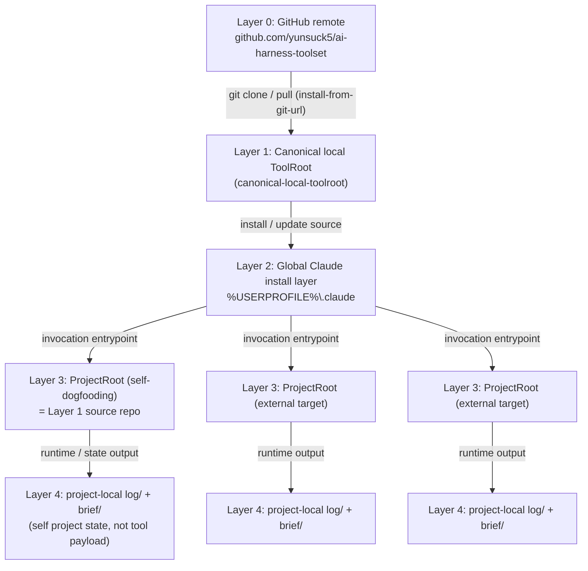
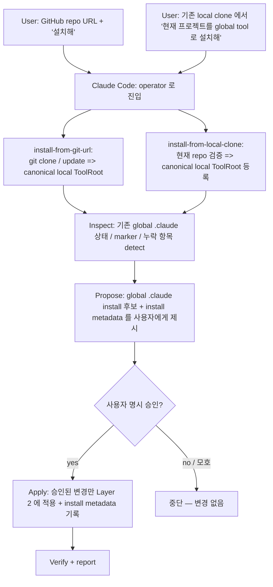
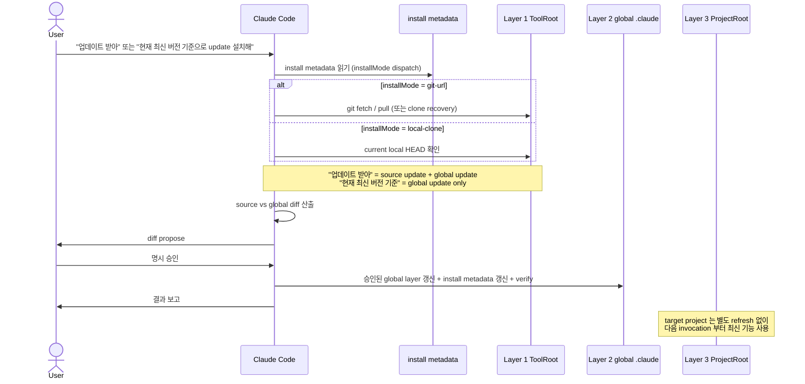
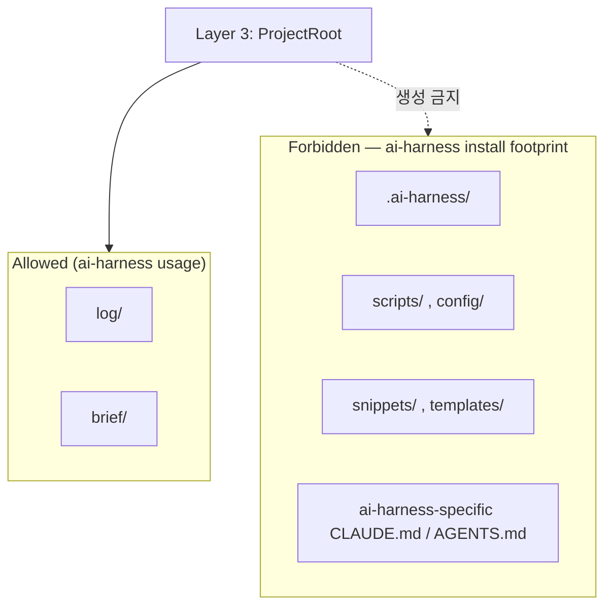
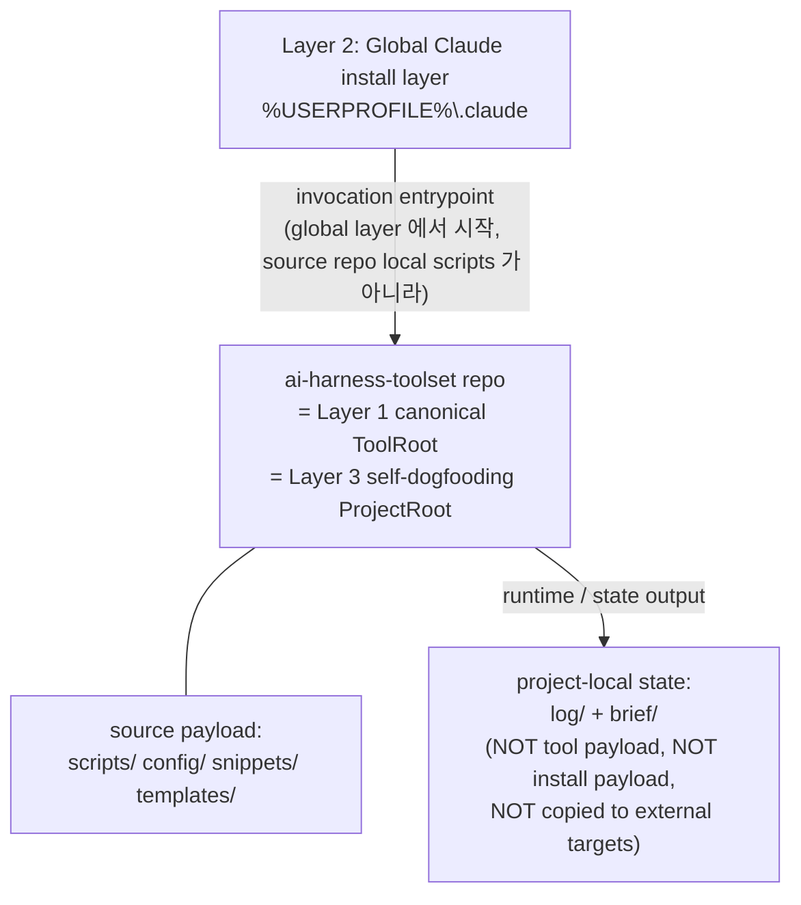
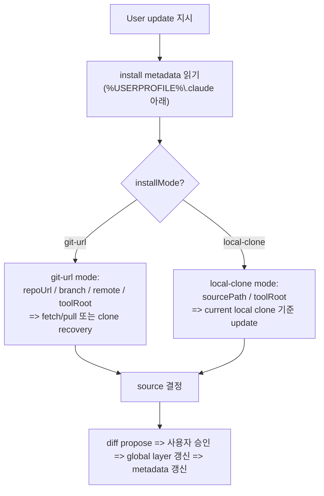

# Global Install / Update / Validation / Self-Adoption Operating Model

> **현행 status routing.** 본 문서는 install/update/global-adoption 의 design/model/record source 다. **current 상태 / completed-ledger / deferred** 의 authoritative 자리는 `docs/systems/install-update/STATUS.md` + `docs/systems/install-update/DEFERRED.md` 다 (전체 routing 진입점: `docs/current/SOURCE_OF_TRUTH.md`; roadmap index: `docs/roadmap/INDEX.md`). 본 문서 본문과 system STATUS 가 충돌하면 current 판단은 STATUS 를 따른다.

본 문서는 `ai-harness-toolset` 의 설치 / 업데이트 / 검증 / self-adoption 운영 모델을 기록하는 **current source-of-truth** 다. 앞으로 Claude Code, ChatGPT Web, 사용자는 global install / update / self-adoption 판단 시 본 문서를 기준으로 한다. **모델의 기록이며, implementation 승인이 아니다.**

> **Install-execution authority note.** install / update / reinstall / operational install 의 **실행** 시 operative contract 는 repo root 의 `INSTALL.md` 하나다. install 실행 중에는 본 문서를 포함한 어떤 `docs/` 파일도 읽을 필요가 없고, 읽어서 install 동작을 결정하지 않는다 (`INSTALL.md` 의 anti-coupling 절). 본 문서는 그 install model 의 design / history record (background) 이며 install-time input 이 아니다 — 본 문서가 stale / 수정 / 삭제되어도 install 동작은 `INSTALL.md` 가 전적으로 결정한다. 본문의 "current source-of-truth" 표현은 운영 **모델 문서들 사이**의 우선순위를 가리킬 뿐이며, install 실행 authority (= `INSTALL.md`) 를 override 하지 않는다. 위 "global install / update / self-adoption 판단 시 본 문서를 기준으로 한다" 는 모델 / 설계 판단에 대한 것이지, install 실행 절차를 본 문서에서 읽으라는 의미가 아니다.

본 문서가 존재한다는 사실만으로 다음 어느 것도 자동 승인되지 않는다.

- 실제 global install / update 의 실행.
- `%USERPROFILE%\.claude` (global Claude install layer) 의 변경.
- global `CLAUDE.md` / `AGENTS.md` 의 변경.
- target project 의 변경.
- commit / push / publish / merge / release.

본 문서는 다음 source-of-truth 문서들의 방향을 구체화하며, 그것들과 충돌하지 않는다. 본 문서가 더 구체적인 영역에서는 본 문서가 current model 이고, 본 문서가 다루지 않는 영역에서는 아래 문서들이 우선한다.

- 운영 계층 결정: `docs/decisions/GLOBAL_ADOPTION_DECISION.md`
- Claude skill 채택 절차: `docs/user_guide/GLOBAL_ADOPTION_PROCEDURE.md`
- shared / global mode invocation contract: `docs/contracts/global-invocation/SHARED_GLOBAL_INVOCATION_CONTRACT.md`
- post-MVP 결정 기록: `docs/decisions/POST_MVP_PLAN.md`
- clean target smoke criteria: preserved in git history
- 운영 backlog: open items in `docs/systems/install-update/BACKLOG.md` (history in git)

본 문서는 위 문서들을 삭제하거나 rewrite 하지 않는다.

Step 3-specific install / update implementation planning 은 본 문서의 **subordinate** 인 `docs/systems/install-update/STEP3_INSTALL_UPDATE_DECISION_GUIDE.md` 가 안내한다. 그 가이드는 본 문서를 **대체하지 않으며**, 본 문서가 더 구체적인 영역에서는 본 문서가 우선한다.

### Path notation

- global Claude install layer 경로는 항상 `%USERPROFILE%\.claude` 로 표기한다. expanded example 이 필요하면 `C:\Users\<USER>\.claude` 처럼 placeholder 를 쓴다. 실제 Windows 사용자 폴더명은 본 문서에 쓰지 않는다.
- canonical local ToolRoot 의 generalized 표현은 `<canonical-local-toolroot>` 다. 현재 system example 은 `H:\Work\ai-harness-toolset\ai-harness-toolset` 이며, example 일 뿐 강제 경로가 아니다. 본 경로는 source / build input (development repo) 이며, shared / global mode 의 default runtime ToolRoot 가 **아니다** — 아래 materialized runtime ToolRoot 항목 참조.
- shared / global mode 의 **materialized runtime ToolRoot** 경로는 `%USERPROFILE%\.claude\ai-harness-toolset\current` 다. 이는 `Get-ToolRoot` 의 channel 3 이 resolve 하는 default 연결 경로이며 (`docs/contracts/global-invocation/SHARED_GLOBAL_INVOCATION_CONTRACT.md` §5.1, D1), Layer 2 (`%USERPROFILE%\.claude`) 아래에 위치한다. development repo (`<canonical-local-toolroot>`) 가 이 경로로 materialize 되는 source/build input 이고, `current` 가 lifecycle script 가 실제 실행되는 runtime ToolRoot 다.
- target project root 의 generalized 표현은 `<ProjectRoot>` 다.

---

## 1. Executive summary

> **Source-cache canonicalization reconciliation (현행 — 본 문서 전체 적용).** 본 문서 §4.2 / §10.2 등에 등장하는 git-url mode 의 `canonical ToolRoot` 와 `clone recovery` 표현은 install / update / restore 의 source 가 InstallArea 안에 **persistent canonical clone** 으로 보존된다는 framing 위에서 작성되었다. 이 framing 은 이후의 사용자 결정으로 **superseded** 되었다. 현행 정합 규칙은 root `INSTALL.md` 가 source-of-truth 다 — 매 git-url action 마다 **run-scoped temporary work area** 에서 fresh clone 으로 source 를 획득하고, action 종료 시 그 work area 를 제거한다. action 사이에 persistent cache 가 보존되지 않으므로 "ToolRoot 가 사라졌으면 clone recovery 를 수행한다" 라는 wording 은 동작상 trivially "항상 fresh clone" 으로 단순화된다. GitHub URL source 의 reinstall 은 `update-source` path 로만 닫히며, "현재 최신 버전 기준으로 update 설치해" 의 no-source-touch path (§4.4) 는 local-clone mode 에만 적용된다. 본 문서 본문의 git-url 관련 잔재 wording (persistent ToolRoot framing, clone recovery 등) 은 historical decision lineage 로 그대로 보존되며, 본 note 와 `INSTALL.md` framing 이 그 모든 잔재 wording 보다 우선한다. 구체 보조 결정은 `docs/systems/install-update/STEP3_INSTALL_UPDATE_DECISION_GUIDE.md` 의 동일 superseded note 와 정합한다.

> **3rd reconciliation (현행 — 본 문서 전체 적용).** 본 문서의 BRIEF / target footprint wording 은 세 단계의 reconciliation 을 거쳤다.
> (1) 1차 — canonical Brief 를 `<ProjectRoot>/log/brief/BRIEF.md` 로 두고 root `<ProjectRoot>/brief/` 를 forbidden 으로 둔 framing; target persistent footprint = `log/` only.
> (2) 2차 — target product canonical Brief 를 `<ProjectRoot>/brief/BRIEF.md` 로 두고 `<ProjectRoot>/log/brief/BRIEF.md` 를 not-canonical 한 source-side primitive seed destination 으로 분류; target persistent footprint = `log/` + `brief/`.
> **(3) 3차 (현행)** — 2차 framing 이 정정되었다. canonical Brief 는 다시 `<ProjectRoot>/log/brief/BRIEF.md` — project-local, operator-local, source-control-excluded runtime artifact under `<ProjectRoot>/log/` (gitignored). **root `<ProjectRoot>/brief/` 는 rejected**, user-home operator-local runtime root (예: `%USERPROFILE%\.ai-harness\projects\<project-key>\...`) 도 rejected. **target persistent footprint = `<ProjectRoot>/log/` only** — BRIEF / Chatlog / Evidence / Review 의 네 runtime artifact 트리는 모두 `<ProjectRoot>/log/` 아래 들어간다. `<ProjectRoot>/log/` 는 source-control-excluded 이며 commit / push / merge / release 대상이 아니다. 현행 source-of-truth 는 `docs/contracts/brief/BRIEF_CONTRACT.md` 다. 본 문서 본문에 남아 있는 1차 / 2차 framing wording (`log/` + `brief/`, `targetFootprintPolicy: log-brief-only`, "self-dogfooding ProjectRoot 의 `brief/`" 등) 은 historical lineage 로 그대로 보존되며, 본 note 와 contract docs 의 framing 이 그 모든 잔재 wording 보다 우선한다.

`ai-harness-toolset` 의 설치 모델은 **사용자가 직접 파일을 배치하지 않고, Claude Code 가 source repo 를 기준으로 global Claude layer 를 install / update 하는 방식** 이다. 사용자는 Claude Code 에 GitHub repo URL 을 주거나 이미 clone 한 local repo 안에서 Claude Code 를 열고, "설치해" / "업데이트 받아" 라고 지시할 뿐이다. Claude Code 가 그 repo 를 canonical local ToolRoot 로 등록 / 갱신하고, 그 source 를 기준으로 global Claude install layer (`%USERPROFILE%\.claude`) 를 install / update 한다. target project 에는 `ai-harness-toolset` payload 를 설치하지 않으며, target project 에 남는 persistent footprint 는 `<ProjectRoot>/log/` 아래 runtime / state artifact (BRIEF, Chatlog, Evidence, Review) 로만 제한된다 — 3차 reconciliation 기준 단일 runtime root 다.

핵심 결론 (decisions):

- 사용자가 직접 hot copy / symlink / junction / `.claude` 파일 배치를 하지 않는다.
- 설치 source 획득 방식은 두 가지다 — GitHub URL 기반(install-from-git-url), 기존 local clone 기반(install-from-local-clone). 두 방식은 source 획득만 다르고 최종 구조는 같다 (§2).
- Claude Code 가 source repo 를 canonical local ToolRoot 로 등록 / 갱신한다.
- Claude Code 가 source repo 를 기준으로 global Claude layer 를 install / update 한다. 업데이트는 global install metadata 기반으로 dispatch 된다 (§4, §5).
- install / update **automation 을 먼저 구현하지 않는다.** 먼저 global behavior validation (manual global activation / controlled global materialization) 을 수행하고, 그 결과를 기준으로 automation 을 구현한다 (§7).
- install / update automation 본체의 scope 는 **runtime ToolRoot channel 3 payload 의 materialize / refresh, install metadata, update dispatch, verification** 으로 제한한다. global instruction file (Claude `%USERPROFILE%\.claude\CLAUDE.md`, Codex `%USERPROFILE%\.codex\AGENTS.md` 또는 `%CODEX_HOME%\AGENTS.md`, Codex user-global `AGENTS.override.md`, project-root `CLAUDE.md` / `AGENTS.md`) 의 managed-block apply 는 automation 본체에 포함되지 않으며, `GLOBAL_ADOPTION_DECISION.md` §6 가 governing 하는 별도의 explicit user-approved global / user config mutation scope 다. 두 scope 는 분리되며, 한쪽의 승인이 다른 쪽을 승인하지 않는다. `%USERPROFILE%\.claude\AGENTS.md` 는 어떤 scope 에서도 valid destination 이 아니며, automation 본체와 managed-block apply scope 모두 본 path 를 생성하지 않는다.
- target project 에는 `ai-harness-toolset` payload 를 설치하지 않는다. target persistent footprint 는 **`<ProjectRoot>/log/` only** 다 (§8 — 3차 reconciliation 기준). BRIEF / Chatlog / Evidence / Review 네 runtime artifact 트리는 모두 `log/` 아래 들어간다.
- `ai-harness-toolset` repo 는 canonical ToolRoot 이면서 self-dogfooding ProjectRoot 인 special case 다. ProjectRoot 로 동작할 때 `<ProjectRoot>/log/` 를 가질 수 있고, 그 안의 runtime artifact (BRIEF / Chatlog / Evidence / Review) 는 source payload 도 install payload 도 아니다 (§9). root `<ProjectRoot>/brief/` 는 self-dogfooding 에서도 만들지 않는다.

implications:

- "설치"의 의미가 target project 단위가 아니라 global Claude layer 단위로 이동한다.
- target project 는 `ai-harness` 기능이 "설치되는 곳" 이 아니라, global Claude layer 가 실행되는 "작업 대상" 이다.
- 다중 target project 운용 시, 각 repo 에 payload 를 복제 / 동기화하는 비용이 사라진다 (`GLOBAL_ADOPTION_DECISION.md` §1, §2 의 다중 프로젝트 cost 누적 문제와 정합).

---

## 2. Installation source acquisition modes

설치의 source 획득 방식은 두 가지다. 두 방식은 **source 를 어떻게 얻는가** 만 다르며, 최종 구조는 동일하다 — canonical ToolRoot → global Claude layer → ProjectRoot runtime artifacts.

### 2.1 install-from-git-url

- 사용자가 Claude Code 에 GitHub repo URL 을 주고 "설치해" 라고 지시한다.
- 전제: repo 가 public 이거나, local system 에 해당 repo 에 대한 Git credential 이 있어야 한다.
- Claude Code 가 그 repo 를 canonical local ToolRoot 로 `git clone` (또는 이미 있으면 update) 한다.
- 이후 그 ToolRoot 를 기준으로 global Claude layer 를 install 한다.

### 2.2 install-from-local-clone

- 사용자가 이미 clone 한 repo root 에서 Claude Code 를 열고 "현재 프로젝트를 global tool 로 설치해" 라고 지시한다.
- 현재 system example: `H:\Work\ai-harness-toolset\ai-harness-toolset`.
- Claude Code 가 현재 repo 를 검증 (올바른 `ai-harness-toolset` source repo 인지 확인) 하고 canonical local ToolRoot 로 등록한다.
- 이후 그 ToolRoot 를 기준으로 global Claude layer 를 install 한다.

### 2.3 두 방식의 공통 구조

```
(GitHub URL | existing local clone)
        => canonical local ToolRoot
        => global Claude install layer
        => ProjectRoot runtime / state artifacts
```

차이는 source 획득 단계뿐이다. canonical ToolRoot 등록 이후의 install / update / runtime 경로는 두 방식이 같다.

---

## 3. Installation model — method comparison

세 가지 설치 방식을 비교한다.

| 방식 | 설명 | 현재 위치 |
|---|---|---|
| **hot copy** | source repo 의 `scripts/` `config/` `snippets/` `templates/` 를 각 target project 안으로 직접 복사 | **historical / fallback.** MVP 검증 단계에서 유효했던 방식이며, 목표 구조가 아니다. |
| **symlink / junction** | target project 안에 source repo 를 가리키는 symlink / junction 을 배치 | **fallback candidate.** direct shared invocation 의 변경 폭이 너무 클 때만 검토되는 후보이며, 목표 구조가 아니다 (`GLOBAL_ADOPTION_DECISION.md` §4 Fallback candidate). |
| **Claude-operated install/update + global `.claude` install layer** | Claude Code 가 source repo (git-url 또는 local-clone 으로 획득) 를 canonical local ToolRoot 로 등록 / 갱신하고, 그 source 를 기준으로 global Claude layer 를 install / update | **목표 방식.** |

decision: 목표 방식은 세 번째 — **Claude-operated install/update + global `.claude` install layer** 다.

추가 구분:

- **installer-first productization 은 현재 범위 밖이다.** `install.ps1` 같은 productized installer 를 서둘러 만들지 않는다 (`GLOBAL_ADOPTION_DECISION.md` §5, §10; `GLOBAL_ADOPTION_PROCEDURE.md` §9). legacy `ai-harness` 의 문제는 global install 아이디어 자체가 아니라, core functionality 검증 이전에 installer / rollback / global mutation 을 먼저 productize 하려 한 sequencing 이었다.
- **단, Claude-operated explicit install/update procedure 는 장기적으로 필요하다.** 이는 installer-first productization 과 다르다 — 자동화된 제품형 installer 가 아니라, Claude Code 가 operator 로서 inspect → detect → propose → 사용자 승인 → apply → verify 의 단계를 따르는 절차다 (`GLOBAL_ADOPTION_DECISION.md` §5, `GLOBAL_ADOPTION_PROCEDURE.md` §5–§7).

### 3.1 Recovery posture — generated payload 의 reinstall-first

generated payload (global Claude install layer 의 `current/` runtime payload + install metadata / integrity artifact) 의 source-of-truth 는 기존 installed payload 가 아니라 **trusted source identity (resolved commit SHA)** 다. 따라서 install / update / reinstall 은 모두 **deterministic overwrite / replace materialization** 이며 (§3 의 목표 방식 + §4 update modes), generated payload 의 partial / unknown / 손상 상태의 회복도 동일한 한 model 로 닫힌다.

- 회복은 기존 payload 를 분석 / 역행 / 부분 수리하는 것이 아니라, trusted source 를 재준비한 뒤 destination 을 통째로 deterministic 하게 다시 만드는 것이다. 즉 "복구" 는 별도 mode 가 아니라 reinstall 그 자체다 — install / reinstall / update 의 destination-side 처리가 동일 overwrite 이기 때문이다.
- 이 model 은 generated payload 에 대한 **transaction log / rollback framework / tamper detection / partial-state reconciliation 을 도입하지 않는다** (§12 non-goals). materialization atomicity 우려는 transaction 구현이 아니라 reinstall-first operational policy 로 닫힌다. 본 toolset 은 손상 / drift 의 **detection** 만 보장하고, recovery 절차는 trusted source 재준비 + deterministic overwrite reinstall 한 줄이다 (`docs/systems/install-update/STEP3_INSTALL_UPDATE_DECISION_GUIDE.md` §19.1 / §19.2 / §19.5, `INSTALL.md` §9 / §9.1).
- 단 **activation surface** 는 generated payload 와 다른 별도 영역이며, 다시 두 종류로 나뉜다. (a) **managed-block instruction file** (`%USERPROFILE%\.claude\CLAUDE.md`, Codex `AGENTS.md` 의 `AI_HARNESS_TOOLSET_GLOBAL` block) 은 marker 밖 사용자 content 를 포함하므로 marker-bounded replace + dry-run / pre-write backup / rollback / verification (`GLOBAL_ADOPTION_DECISION.md` §6, `INSTALL.md` §9.1 / §10) 으로 처리하며 whole-file reinstall-overwrite 대상이 아니다. (b) **Claude skill `SKILL.md`** 는 managed-block file 이 아니라 canonical-overwrite activation artifact 로, 현행 contract 상 source `snippets/claude-skills/<name>/SKILL.md` 의 whole-file byte overwrite + post-write SHA-256 verify + 사용자 수정 overwrite 사전 고지 모델이다 (`INSTALL.md` §10, 본 문서 §9.1) — **read-only dry-run preview (source/destination hash + `create | overwrite | unchanged` action + overwrite 고지) 는 있으나** pre-write backup / rollback / sidecar 는 두지 않는다 (Phase 4a `scripts/activate-global.ps1` canonical-overwrite path). 어느 영역의 회복도 하나의 transaction / rollback framework 로 묶지 않는다.

---

## 4. Update modes

업데이트는 global install metadata 기반으로 dispatch 된다.

### 4.1 metadata-dispatched update

- global install layer 에 저장된 install metadata (§5) 를 읽어, `installMode` 에 따라 update source 를 결정한다.
- 즉 사용자는 update source 를 매번 다시 지정하지 않으며, 최초 install 시 기록된 metadata 가 update 경로를 결정한다.

### 4.2 git-url mode update

- metadata 의 `repoUrl` / `branch` / `remote` / `toolRoot` 를 사용한다.
- canonical ToolRoot 에서 `git fetch` / `git pull` 을 수행하거나, ToolRoot 가 사라졌으면 `repoUrl` 로 clone recovery 를 수행한다.
- 이후 갱신된 source 를 기준으로 global Claude layer 를 갱신한다.

### 4.3 local-clone mode update

- metadata 의 `sourcePath` / `toolRoot` 를 사용한다.
- 현재 local clone 을 기준으로 update 하거나, 이미 `git pull` 된 current HEAD 를 기준으로 global install layer 만 갱신한다.

### 4.4 두 가지 사용자 업데이트 명령

사용자가 말하는 업데이트 지시는 두 종류로 나뉜다.

- **"업데이트 받아"** — source update + global install update. 즉 ToolRoot 의 source 를 먼저 최신화 (fetch/pull) 한 뒤, 그 source 를 기준으로 global install layer 를 갱신한다.
- **"현재 최신 버전 기준으로 update 설치해"** — current local HEAD 기준 global install update only. ToolRoot 의 source 는 건드리지 않고 (이미 원하는 HEAD 에 있다고 보고), 그 HEAD 를 기준으로 global install layer 만 갱신한다.

어느 경우에도 global install layer 의 실제 변경은 inspect → diff propose → 사용자 명시 승인 → apply → verify 단계를 거친다 (`GLOBAL_ADOPTION_PROCEDURE.md` §6).

---

## 5. Global install metadata

### 5.1 위치와 성격

- install metadata 는 **global install layer (`%USERPROFILE%\.claude`) 아래** 에 둔다.
- metadata 는 **target project 에 생성하지 않는다.**
- metadata 는 source repo 의 tracked actual state 가 **아니다.** source repo 에는 metadata 의 schema 또는 example 정도만 둘 수 있고, 실제 install metadata instance 는 global layer 에만 존재한다.
- example 경로 (placeholder): `%USERPROFILE%\.claude\ai-harness-toolset\install-metadata.json`. 정확한 파일명 / 위치는 implementation 단계에서 확정한다.

### 5.2 최소 필드 후보

| 필드 | 의미 |
|---|---|
| `schemaVersion` | metadata schema 버전 |
| `tool` | 도구 식별자 (예: `ai-harness-toolset`) |
| `installMode` | `git-url` 또는 `local-clone` |
| `repoUrl` | git-url mode 의 remote URL |
| `sourcePath` | local-clone mode 의 source repo path |
| `toolRoot` | canonical local ToolRoot 절대경로 |
| `branch` | 추적 branch |
| `remote` | git remote 이름 |
| `installedHead` | 최초 install 시점의 source HEAD commit |
| `lastUpdatedHead` | 마지막 update 시점의 source HEAD commit |
| `installedAt` | 최초 install UTC 시각 |
| `lastUpdatedAt` | 마지막 update UTC 시각 |
| `targetFootprintPolicy` | target footprint 정책. 현행 (3차 reconciliation) 값: `log-only` — BRIEF / Chatlog / Evidence / Review 모두 `<ProjectRoot>/log/` 아래에 들어간다. 이전 (2차) 값 `log-brief-only` 는 historical 로 superseded. |
| `managedBy` | 관리 주체. 현재 값: `claude-code` |

### 5.3 metadata example (placeholder values)

```json
{
  "schemaVersion": 1,
  "tool": "ai-harness-toolset",
  "installMode": "local-clone",
  "repoUrl": "https://github.com/yunsuck5/ai-harness-toolset",
  "sourcePath": "H:\\Work\\ai-harness-toolset\\ai-harness-toolset",
  "toolRoot": "H:\\Work\\ai-harness-toolset\\ai-harness-toolset",
  "branch": "main",
  "remote": "origin",
  "installedHead": "<commit-sha>",
  "lastUpdatedHead": "<commit-sha>",
  "installedAt": "<utc-timestamp>",
  "lastUpdatedAt": "<utc-timestamp>",
  "targetFootprintPolicy": "log-only",
  "managedBy": "claude-code"
}
```

위 example 의 path 는 현재 system example 이다. metadata instance 자체는 `%USERPROFILE%\.claude` 아래에 두며, 실제 Windows 사용자 폴더명은 문서에 쓰지 않는다.

---

## 6. Layer model

본 모델은 5 개 layer 를 구분한다.

### Layer 0 — GitHub remote source

- `https://github.com/yunsuck5/ai-harness-toolset`
- remote source-of-truth 이며, install-from-git-url 모드의 clone / update 원천이다.

### Layer 1 — Canonical local ToolRoot

- generalized: `<canonical-local-toolroot>`. 현재 system example: `H:\Work\ai-harness-toolset\ai-harness-toolset`.
- Layer 0 GitHub repo 의 local clone (install-from-git-url) 이거나, 사용자가 이미 가지고 있던 local clone (install-from-local-clone) 이다.
- **source / build input 이다** — global install layer (Layer 2) 의 materialized runtime ToolRoot 를 만드는 원천이며, 그 자체가 shared / global mode 의 default runtime ToolRoot 는 아니다.
- `ai-harness-toolset` 자체의 source repo 이기도 하다.
- as-built ToolRoot resolution 모델 (`SHARED_GLOBAL_INVOCATION_CONTRACT.md` §5.1, D1) 에서 본 경로가 `Get-ToolRoot` 의 결과 ToolRoot 가 되는 것은 **channel 4 (dogfooding mode)** — source repo 운영자가 source repo 안에서 직접 작업하는 경우 — 에 한정된다. shared / global mode 의 default 연결 경로는 channel 3 의 materialized runtime ToolRoot (`%USERPROFILE%\.claude\ai-harness-toolset\current`, Layer 2 아래) 다. `GLOBAL_ADOPTION_DECISION.md` §8 의 `ToolRoot` 개념과는 정합하되, "어느 경로가 runtime ToolRoot 인가" 는 channel resolution 에 따라 달라진다. `ScriptRoot` / `ConfigRoot` / `TemplateRoot` 는 resolve 된 ToolRoot 아래의 `scripts/` `config/` `templates/` 다.

### Layer 2 — Global Claude install layer

- `%USERPROFILE%\.claude` (expanded example: `C:\Users\<USER>\.claude`).
- commands / skills / managed prompts / metadata / ToolRoot reference 가 생성 / 갱신되는 위치다.
- install metadata (§5) 가 이 layer 아래에 위치한다.
- 이 layer 안의 **valid 한 user-facing 파일** 은 다음 두 분류로만 구성된다. (a) tool-payload — `%USERPROFILE%\.claude\ai-harness-toolset\current\` (channel 3 materialized runtime ToolRoot), `%USERPROFILE%\.claude\skills\<name>\SKILL.md` (각 source skill `snippets/claude-skills/<name>/SKILL.md` 의 Claude skill mirror; 현재 ship 되는 것은 `ai-harness-review` 와 `ai-harness-brief` 둘 — 후자는 Batch 2C-2 로 manual Brief 절차를 소유). 둘 모두 explicit user-approved 시에만 install / refresh / overwrite 된다. (b) user-owned managed-block instruction — `%USERPROFILE%\.claude\CLAUDE.md`. 이 파일은 user-owned 이며 ai-harness 는 managed-block insert / replace 만 수행할 수 있고 whole-file overwrite 는 금지된다 (`GLOBAL_ADOPTION_DECISION.md` §6). **이 layer 아래에 `%USERPROFILE%\.claude\AGENTS.md` 는 어떠한 agent 의 global instruction 경로도 아니며, ai-harness 는 이 path 를 생성하지 않는다.** Codex 의 user-global instruction 경로는 별개 directory tree (`%USERPROFILE%\.codex\AGENTS.md` 기본; `CODEX_HOME` set 시 `%CODEX_HOME%\AGENTS.md`; 동일 scope 의 `AGENTS.override.md` 가 `AGENTS.md` 보다 우선) 에 위치하며, Layer 2 외부다.
- **materialized runtime ToolRoot `%USERPROFILE%\.claude\ai-harness-toolset\current` 가 이 layer 아래에 위치한다.** 이는 `Get-ToolRoot` 의 channel 3 이 resolve 하는 shared / global mode 의 default 연결 경로이며 (`SHARED_GLOBAL_INVOCATION_CONTRACT.md` §5.1, D1), Layer 1 의 source/build input (`<canonical-local-toolroot>`) 으로부터 materialize 된다. 디렉터리가 부재하면 `Get-ToolRoot` 는 다음 channel 로 skip 하고, 존재하지만 payload 가 불완전하면 fail-fast 한다.
- `AI_HARNESS_TOOL_ROOT` 환경변수 (`Get-ToolRoot` channel 2) 는 위 materialized runtime ToolRoot 를 가리는 **override / debug / development validation 용** 이며, default 연결 방식이 아니다. User / Machine scope 에 고정 설정하지 않고, 디버그·개발 repo 검증이 필요한 세션에서만 **process-scope** 로 set 하는 것을 권장한다 — User / Machine scope 고정은 channel 2 가 항상 channel 3 을 가려 stable default 모델을 무력화한다.
- toolset payload 전체를 target project 에 복사하지 않고, 이 global layer 를 통해 기능을 노출한다.
- Claude skill 자산의 경우 `GLOBAL_ADOPTION_PROCEDURE.md` §3 의 `GlobalSkillRoot` (`%USERPROFILE%\.claude\skills`) 가 이 layer 안에 위치한다.
- 이 layer 의 실제 변경은 항상 사용자 명시 승인을 요구한다 (`GLOBAL_ADOPTION_DECISION.md` §6, §7). materialized runtime ToolRoot (`...\ai-harness-toolset\current`) 의 실제 materialization 은 별도 scoped 작업이며 본 문서 작성 시점에 수행되지 않았다 (§13 참조).

### Layer 3 — ProjectRoot

실제 작업 대상 repo 다. 본 모델에서 다루는 ProjectRoot 예시는 다음 둘이다 (현재 system example).

- `H:\Work\ai-harness-toolset\ai-harness-toolset` (self-dogfooding ProjectRoot — §9 참조)
- `H:\Work\ai-harness-toolset\ai-harness-toolset-mvp-test-acceptance`

ProjectRoot 는 `ai-harness-toolset` payload 를 설치받는 위치가 **아니다.** global Claude layer (Layer 2) 가 실행될 때의 작업 대상일 뿐이다.

### Layer 4 — Project-local runtime / state artifacts

- `<ProjectRoot>\log\`
- `<ProjectRoot>\brief\`
- review / evidence / chatlog / brief 같은 project-local 산출물이 생성되는 위치다.
- `GLOBAL_ADOPTION_DECISION.md` §4 의 target-local state / result boundary (`brief/`, `log/chatlog/`, `log/evidence/`, `log/review/`) 와 정합한다. `log/` 는 그 하위 `chatlog/` `evidence/` `review/` 를 포함한다.
- global `.claude` layer (Layer 2) 와 canonical ToolRoot (Layer 1) 는 runtime evidence dump 위치가 아니다.
- self-dogfooding ProjectRoot (Layer 1 = Layer 3) 의 경우에도 `log/` 와 `brief/` 가 project-local state 로 존재할 수 있다. 단 그 `brief/` 는 source payload / install payload 가 아니다 (§9 참조).
- `log/brief/` 디렉터리는 어느 경우에도 만들지 않는다. `log/` 는 runtime artifact 트리이고 brief 의 자리가 아니다 (`POST_MVP_PLAN.md` §3, `BRIEF_CONTRACT.md`).

> **Superseded — three-step reconciliation.** 위 §6 Layer 4 의 BRIEF / footprint 관련 wording 은 §9.3 의 reconciliation list 가 기록하는 세 단계의 변천을 거쳤다.
> **(1) 1차 reconciliation (historical):** canonical Brief 를 `<ProjectRoot>/log/brief/BRIEF.md` 로 두고 root `<ProjectRoot>/brief/` 를 forbidden 으로 둔 framing; project-local footprint = `log/` only.
> **(2) 2차 reconciliation (historical, superseded):** target product canonical Brief 를 `<ProjectRoot>/brief/BRIEF.md` 로 두고 `<ProjectRoot>/log/brief/BRIEF.md` 를 not-canonical 한 seed destination 으로 분류; project-local footprint = `log/` + `brief/`.
> **(3) 3차 reconciliation (현행 기준):** 2차 framing 이 정정되어 canonical Brief 는 다시 `<ProjectRoot>/log/brief/BRIEF.md` — project-local, operator-local, source-control-excluded runtime artifact under `<ProjectRoot>/log/`. **root `<ProjectRoot>/brief/` 는 rejected**, user-home operator-local runtime root 도 rejected, **project-local footprint = `<ProjectRoot>/log/` only** (BRIEF, Chatlog, Evidence, Review 모두 `log/` 아래). canonical source-of-truth 는 `docs/contracts/brief/BRIEF_CONTRACT.md` 와 `docs/contracts/chatlog/CHATLOG_CONTRACT.md` 다. 위 §6 Layer 4 본문 (`<ProjectRoot>\brief\` 를 별도 footprint 항목으로 둔 것, "self-dogfooding ProjectRoot 의 `brief/`", "`log/brief/` 디렉터리는 어느 경우에도 만들지 않는다" 등) 은 historical model 기록으로 보존하며, 본 note 의 3차 framing 이 우선한다.

---

## 7. Validation before install/update implementation

install / update **automation 을 먼저 구현하지 않는다.** 먼저 global behavior 가 실제로 성립하는지 검증한다.

### 7.1 manual global activation / controlled global materialization

- 이 초기 검증 단계를 **"manual global activation for validation"** 또는 **"controlled global materialization"** 이라 부른다.
- 실무적으로는 기존 hot copy 와 비슷하게, 필요한 **최소** entrypoint / command / skill / metadata 를 global layer 에 **제한적으로** materialize 해보는 형태일 수 있다.
- 단, 이것은 target project hot copy 가 **아니다.** 복사 / 생성 위치는 target project 가 아니라 `%USERPROFILE%\.claude` 다.
- 이 단계도 실제 global mutation 이므로 별도 scoped 승인을 거친다. 본 문서가 이 단계를 자동 승인하지 않는다.

### 7.2 무엇을 검증하는가

manual global activation 의 목적은 다음이 실제로 성립하는지 검증하는 것이다.

- global entrypoint — invocation 이 global `.claude` layer 에서 시작되는가.
- ToolRoot / ProjectRoot 분리 — script 가 global / shared ToolRoot 에서 실행되면서 runtime artifact 는 ProjectRoot 로 쓰는가 (`GLOBAL_ADOPTION_DECISION.md` §8 core audit question 과 정합).
- target footprint — target project 에 `<ProjectRoot>/log/` 외의 ai-harness payload 가 생기지 않는가 (3차 reconciliation 기준; 이전 `log/` + `brief/` framing 은 superseded — §1 / §6 Layer 4 superseded note 참조).
- runtime artifact 위치 — runtime artifact 가 ProjectRoot-local 로만 생성되는가.

### 7.3 sequencing

```
GLOBAL_INSTALL_UPDATE_MODEL.md 확정
  => manual global activation / controlled global materialization (global behavior validation)
  => validation 통과
  => install / update automation 구현
  => install / update validation
```

validation 이 통과한 뒤에 install / update automation 을 구현한다. validation 이전에 automation 을 먼저 만들지 않는다 (legacy `ai-harness` 의 sequencing 실수를 반복하지 않는다 — `GLOBAL_ADOPTION_DECISION.md` §1, §2).

---

## 8. Target project footprint contract

target project 에 허용되는 persistent footprint 와 금지 항목을 구분한다.

### Allowed (ai-harness usage 기준 — 3차 reconciliation)

- `<ProjectRoot>/log/` — project-local, operator-local, source-control-excluded runtime root. BRIEF / Chatlog / Evidence / Review 의 네 runtime artifact 트리가 모두 이 한 자리 아래로 들어간다 (`<ProjectRoot>/log/brief/BRIEF.md`, `<ProjectRoot>/log/chatlog/`, `<ProjectRoot>/log/evidence/`, `<ProjectRoot>/log/review/`).

### Forbidden — ai-harness installation 목적의 생성 금지

- `.ai-harness/`
- `scripts/`
- `config/`
- `snippets/`
- `templates/`
- ai-harness 전용 `CLAUDE.md`
- ai-harness 전용 `AGENTS.md`
- root `<ProjectRoot>/brief/` — rejected (canonical Brief 는 `<ProjectRoot>/log/brief/BRIEF.md`; §1 3차 reconciliation note 참조).
- user-home operator-local runtime root — 예: `%USERPROFILE%\.ai-harness\projects\<project-key>\...`. 본 문서가 canonical runtime root 로 도입하지 않는다.

> **Historical (superseded).** 이전 (2차) framing 의 Allowed 항목은 `log/` + `brief/` 였다. `brief/` 항목은 3차 reconciliation 으로 rejected 되었으며, 위 §1 / §6 Layer 4 의 superseded note 가 본 §8 의 historical wording 도 함께 정정한다.

### target project 자체 문서와 ai-harness footprint 의 구분

- target project 가 **자체 운영 문서** 로서 독립적인 `CLAUDE.md` / `AGENTS.md` 를 가지는 것은 별개의 문제다. 이는 project-specific layer 의 영역이다 (`GLOBAL_ADOPTION_DECISION.md` §3 Project-specific layer).
- 그러나 `ai-harness-toolset` 설치를 위해 target project 안에 `CLAUDE.md` / `AGENTS.md` 를 생성하는 것은 목표 구조가 **아니다.** ai-harness 운영 규칙은 global layer (Layer 2) 가 책임진다.
- 즉, target project 의 자체 `CLAUDE.md` / `AGENTS.md` (있을 수 있음) 와, ai-harness install footprint (없어야 함) 는 다른 것이다.

implication: target project 는 ai-harness 기능이 "설치되는 곳" 이 아니라, global Claude layer 가 실행되는 작업 대상이다. target repo shape 의 default 는 `.ai-harness/` 없음, scripts / templates / config / snippets 복사본 없음이다 (`GLOBAL_ADOPTION_DECISION.md` §4 Preferred target repo shape).

---

## 8A. Deployed runtime extension activation surface 정책 (forced-copy + final-verification)

본 절은 **deployed runtime extension** 이 install / update / uninstall lifecycle 에서 어떻게 다루어져야 하는지를 정의하는 governance 정책이다. 본 절 자체는 현재 동작을 바꾸지 않는다 — 현재 concrete activation surface 는 4개다 (두 managed block + source skill `ai-harness-review` / `ai-harness-brief` 당 하나의 mirror; 아래 "현재 instantiation"). 본 절은 **앞으로 deployed runtime extension 을 추가할 때** 따라야 할 규칙과, 그것을 누락하지 못하도록 하는 checklist 를 명시한다. 본 절은 어떤 구현도 승인하지 않는다 (구현은 각기 별도 scoped 승인 — §12 non-goals, install-update STATUS 의 change discipline 과 정합).

### 정의 — deployed runtime extension = deployed activation surface

source-managed 한 runtime extension 이 (a) snippet payload 에서 참조되거나, (b) 현재 runtime workflow 에서 참조되거나, (c) install / adoption surface 에서 참조되면, 그것은 **deployed activation surface** 로 취급된다. 최소한 다음을 포함한다.

- function-level skill — `snippets/claude-skills/<skill-name>/SKILL.md`.
- hook — source-managed hook 이 도입되는 경우 (현재 미도입; 도입 시 본 정책을 동일 적용).
- 그 밖에 user / global / project runtime 위치에 반드시 존재해야 하는 모든 future deployed runtime extension.

### forced-copy + final-verification

이 프로젝트의 install / update 모델은 **강제 복사 + 최종 검증** 이다. deployed activation surface 에 대해 다음이 성립해야 한다.

1. **source payload 복사만으로는 불충분하다.** payload root (`snippets/` 등) 가 `current/` 로 force-copy 되는 것은 materialization 일 뿐이며, runtime 도달가능성을 보장하지 않는다.
2. **runtime mirror + verification 이 필수다.** install / update 후 runtime 목적지 (skill = `<ClaudeHome>/skills/<skill-name>/SKILL.md`) 에 해당 extension 파일이 실제로 존재하고 canonical source 와 byte-identical 해야 한다 (skill mirror 의 mutation class = `canonical-overwrite`: 병합 없는 whole-file overwrite + post-write hash 검증).
3. **runtime 목적지가 install / update 후 부재하거나 drift 면 그 install / update 는 완료된 것이 아니다 — optional activation state 가 아니다.** 경로별 정확한 status (operative 출처 `INSTALL.md` §13.1 / §13.2):
   - **최종 검증** `install-update.ps1 -Mode verify` 는 activation surface byte-identity fail 을 **`verify_failed`** 로 보고한다 (activation surface — 두 managed block + source skill 당 하나의 mirror — 중 하나라도 mismatch → `verify_failed`; Mode `verify` 는 `activation_pending` 을 emit 하지 않는다).
   - name-based **`update-source`** flow 에서는 activation apply 가 별도 explicit step (global-mutation boundary) 이므로, payload 는 갱신됐으나 activation surface 가 drift 면 **`activation_pending` / `result=INCOMPLETE`** 로 보고한다 — 이는 "complete" 가 아니라 **반드시 수행해야 할 activation follow-up 이 남은 명시적 incomplete state** 이며 (status precedence: `verify_failed` > `activation_pending`), payload-only 성공을 activation 완료로 오인하지 않게 한다.
   - `activate-global.ps1 -Apply` 의 post-write 검증은 mismatch 를 **`activation_applied_verify_failed`** 로 fail 보고한다.
   - 어느 경로에서도 missing / drifted deployed runtime extension 이 조용히 "설치 완료" 로 통과하지 않는다.
4. **uninstall 은 owned deployed activation surface 를 회수해야 한다.** 설치 시 mirror 한 extension 디렉터리 / 파일을 uninstall 이 orphan 으로 남기지 않는다. uninstall 은 **owned (source inventory 로 식별된) surface 만** 제거하고, 사용자가 둔 비-owned sibling extension 은 보존한다.

### generic inventory model (single-extension 하드코딩이 아니라)

deployed activation surface 의 enumeration 은 **generic inventory model** 을 따른다.

- 모든 source skill (`snippets/claude-skills/*/SKILL.md`) 은 forced mirror + verification target 이 된다.
- source-managed hook 이 도입되면, 모든 그러한 hook 도 forced mirror + verification target 이 된다.
- future deployed runtime extension type 은 자신의 **{source inventory, runtime mirror destination, verification rule, uninstall rule}** 을 명시적으로 선언해야 한다.
- source inventory 는 **deterministic 하고 local-first** 여야 한다 — directory enumeration (예: `snippets/claude-skills/*/SKILL.md` glob) 을 우선한다. **별도 registry 는 local inspection 이 directory enumeration 으로 불충분함을 증명하기 전에는 도입하지 않는다.**

### checklist — 새 deployed runtime extension 을 추가할 때

새 skill / hook / runtime extension 을 추가하는 변경은 **같은 approved scope 안에서** 다음을 모두 점검 / 갱신해야 한다. 하나라도 누락하면 그 extension 은 "설치되었다" 고 간주하지 않는다.

- source location / inventory rule
- runtime mirror destination
- install / update forced-copy behavior
- install / update final verification
- uninstall owned-surface cleanup
- activation surface 의 count / name / path / mirror class 를 가정하는 test
- install / update / uninstall activation surface 를 기술하는 docs
- routing / ownership 이 바뀌면 source-of-truth / status surface

### hook 구현 시 (도입되는 경우)

hook 이 나중에 도입되면 본 정책을 동일하게 따른다.

- hook source 파일이 payload staging area (`current/` 등) 에 존재한다는 사실만으로 "설치되었다" 고 간주하지 않는다.
- hook 의 runtime destination, final verification, uninstall cleanup 은 **같은 approved scope** 의 일부여야 한다.
- 본 정책은 hook 을 lifecycle 에서 어떻게 다루는지를 정의할 뿐, hook **도입 자체를 승인하지 않는다.** daemon / watcher / scheduler / background hook 의 도입은 별개의 hard-boundary 결정이며, snippet 의 "Forbidden" no-hook 불변은 유지된다.

### 현재 instantiation (사실 — 변경 아님)

`scripts/lib/activation-surface.ps1` 의 `Get-ActivationSurfacePlan` 은 activation surface 를 두 managed block (Claude `CLAUDE.md`, Codex `AGENTS.md` / `AGENTS.override.md`) + **각 source skill (`snippets/claude-skills/<name>/SKILL.md`) 당 하나의 `canonical-overwrite` mirror** (목적지 `<ClaudeHome>/skills/<name>/SKILL.md`, surface 이름 `skill-mirror:<name>`) 로 **generic·deterministic·local-first 열거** 한다. 이 generic enumeration 은 **Batch 2C 의 2C-0 (generic deployed-extension mirror + verification) 으로 구현되어 있다** — resolver 는 더 이상 단일 skill 을 하드코딩하지 않는다. source 에 추가되는 skill 은 자동으로 forced mirror + final-verify 대상이 되며, install/update 후 runtime 에 없거나 drift 면 위 forced-copy + final-verification 규칙대로 미완료로 처리된다. 현재 ship 되는 skill 은 `ai-harness-review` 와 `ai-harness-brief` 둘이라 concrete surface 수는 4개다 — `ai-harness-brief` 는 source skill 이므로 lifecycle forced-mirror + final-verify 대상이며, manual Brief 절차는 Batch 2C-2 로 snippet 에서 이 skill 로 이전되었다 (이후 routing-pointer-removal batch 로 snippet 의 skill-routing pointer 까지 제거, 다시 **Batch 3** 에서 `## Brief` section 자체가 제거됨 — skill discovery 는 각 skill 의 `description` 가 담당; `docs/systems/skills/STATUS.md` SK-05). 본 절(generic inventory model 의 governing 정책 + checklist)은 향후 추가되는 skill / hook / runtime extension 에 계속 적용된다.

### operative / 구현 pointer

- install / update final status vocabulary (`verify_pass` / `verify_failed` / `activation_pending` / `complete` 등) 와 그 invariants 의 operative 계약: `INSTALL.md` §13.1 / §13.2. verify entry helper 는 §5.1, managed-block / canonical-overwrite mutation class 는 §9.1 / §10.
- activation surface resolver (source→destination map + mutation class, single home): `scripts/lib/activation-surface.ps1`.
- uninstall owned-surface 설계: `docs/systems/install-update/UNINSTALL_LIFECYCLE_DESIGN.md`.
- skill 채택 manual 절차: `docs/user_guide/GLOBAL_ADOPTION_PROCEDURE.md` — §2 가 추가 skill 에 동일 manual 절차를 적용하나, 그 manual 절차는 본 절의 lifecycle forced mirror + verify 를 **대체하지 않는다** (manual 절차는 사용자 편의 경로이고, lifecycle 보장이 source-of-truth 다).

---

## 9. Self-adoption model

`ai-harness-toolset` repo 는 **special case** 다.

> **BRIEF wording note — §9 전체에 적용 (three-step reconciliation).** §9.1–§9.5 본문에 등장하는 `brief/` (= root `<ProjectRoot>/brief/`) 와 `log/brief/BRIEF.md` 표현은 **historical / intermediate model 기록**이다. 세 단계의 reconciliation 을 거쳤다.
> **(1) 1차 reconciliation (historical):** canonical 을 `<ProjectRoot>/log/brief/BRIEF.md` 로 옮기고 root `<ProjectRoot>/brief/` 를 forbidden 으로 둔 framing. §9.3 의 "Reconciliation 완료" note 가 이 1차 단계를 기록한다.
> **(2) 2차 reconciliation (historical, superseded):** 그 framing 이 정정되어 target repo product canonical Brief 를 `<ProjectRoot>/brief/BRIEF.md` 로 두고, `<ProjectRoot>/log/brief/BRIEF.md` 를 not-canonical 한 source-side primitive seed destination (operator-local runtime artifact, gitignored under `log/`) 으로 분류; root `<ProjectRoot>/brief/` 는 forbidden 이 아니라는 framing.
> **(3) 3차 reconciliation (현행 기준) — 문서 전체 적용.** 2차 framing 도 정정되었다. **canonical Brief 는 다시 `<ProjectRoot>/log/brief/BRIEF.md`** — project-local, operator-local, source-control-excluded runtime artifact under `<ProjectRoot>/log/` (gitignored). **root `<ProjectRoot>/brief/` 는 rejected**, user-home operator-local runtime root (예: `%USERPROFILE%\.ai-harness\projects\<project-key>\...`) 도 rejected, **target persistent footprint = `<ProjectRoot>/log/` only** (BRIEF / Chatlog / Evidence / Review 모두 `log/` 아래). BF Level 은 path 가 아니라 save / restore capability maturity 다 (BF Level 1/2 = manual save/restore discipline; BF Level 3 = deterministic Brief maintenance / validation / stale warning / session-start guidance — 미구현 future scoped work; 무요청 session-start restore-offer automation 은 retire 됨 — `docs/systems/brief/DEFERRED.md` BR-D-02). canonical source-of-truth 는 `docs/contracts/brief/BRIEF_CONTRACT.md` 와 `docs/contracts/chatlog/CHATLOG_CONTRACT.md` 다. 본 §9 어느 절의 wording (1차 / 2차 framing 기준 wording 어느 것이든) 이 3차 기준과 충돌하면 본 note 와 contract docs 가 우선한다. `log/chatlog/current/resume.md` · `summary.md` 는 canonical BF Level 1/2 artifact 가 아니라 failed intermediate / legacy migration source / deprecation candidate 다 (`docs/contracts/chatlog/CHATLOG_CONTRACT.md`).

### 9.1 fact

- `<canonical-local-toolroot>` (현재 system example `H:\Work\ai-harness-toolset\ai-harness-toolset`) 는 canonical ToolRoot source repo (Layer 1) 이면서 동시에 self-dogfooding ProjectRoot (Layer 3) 다.
- 이 repo 안에 `scripts/` `config/` `snippets/` `templates/` `docs/` 가 존재하는 것은 source repo 이기 때문에 정상이다.
- self-dogfooding ProjectRoot 로 동작할 때, `log/` 가 project-local state 로 존재해도 된다 (3차 reconciliation 기준; BRIEF / Chatlog / Evidence / Review 모두 `<ProjectRoot>/log/` 아래). 위 §9 BRIEF wording note 참조 — 본 줄의 1차 / 2차 framing 잔재 wording 은 superseded. root `<ProjectRoot>/brief/` 는 self-dogfooding 에서도 만들지 않는다 (rejected).

### 9.2 decision — source payload 와 project-local state 의 분리

self repo 의 `brief/` 는 project-local state 일 뿐이며, 다음 어느 것도 **아니다.**

- tool payload 가 아니다.
- global install payload 가 아니다.
- external target 에 복사되지 않는다.
- package / bundle / install 대상에서 제외한다.

즉 self repo 에서 `scripts/` `config/` `snippets/` `templates/` 는 **source payload** 이고, `<ProjectRoot>/log/` (3차 reconciliation 기준; BRIEF / Chatlog / Evidence / Review 모두 그 아래) 는 **project-local state** 다. 이 둘은 문서상 명확히 분리된다 — self repo 가 ProjectRoot 로도 동작한다는 사실이, project-local state 를 source payload 로 승격시키지 않는다. (source payload vs project-local state 의 분리라는 decision 은 유효하다. 본 줄의 1차 / 2차 framing 잔재 wording — `brief/` 를 별도 항목으로 적은 표현 — 은 위 §9 BRIEF wording note 의 3차 reconciliation 으로 superseded.)

### 9.3 supersedes / pending reconciliation

- 본 §9 는 이전의 "source repo 는 root `brief/` 를 가지지 않는다" posture 를 **model 수준에서 supersede** 한다. 이전 posture 의 의도 (source repo 에 `brief/BRIEF.md` 를 tracked source artifact 로 commit 하지 않는다) 는 유지되지만, self repo 가 ProjectRoot 로 동작할 때의 project-local `brief/` state 는 그 금지 대상이 아니다.
- 현재 `scripts/brief-init.ps1` 의 `Test-IsSourceRepoRoot` refuse, 그리고 `docs/contracts/brief/BRIEF_CONTRACT.md` / `docs/decisions/POST_MVP_PLAN.md` §3 의 literal wording 은 이전 posture 를 반영한다. 이들을 본 §9 의 clarified model 과 정합화하는 작업 (script + contract docs reconciliation) 은 **별도 scoped work** 이며, 본 문서 작성 goal 의 범위가 아니다. 본 문서는 그 reconciliation 을 자동 승인하지 않는다.
- **Reconciliation 1차 (BRIEF posture reconciliation, historical).** 1차 reconciliation 에서 BRIEF 의 canonical 위치를 `<ProjectRoot>/log/brief/BRIEF.md` 로 옮기고 root `<ProjectRoot>/brief/` 를 forbidden 으로 둔 framing 이 채택되었다. target project 의 persistent footprint 는 `log/` only 로 정리되었다. 이 단계 자체는 이미 supersede 되었다 (아래 2차 항목 참조).
  - 위 1차 framing 하에서 작성된 본 문서의 wording — target footprint 를 `log/` + `brief/` 로 적은 표현, `targetFootprintPolicy: log-brief-only`, `<ProjectRoot>/brief/` 또는 `<ProjectRoot>\brief\` 를 별도 footprint / project-local state 항목으로 둔 모든 언급, "project-local log/ + brief/" 형태의 diagram node — 는 historical model 기록으로 그대로 보존된다.
- **Reconciliation 2차 (historical, superseded).** 1차 framing 이 정정되어 target repo product canonical Brief 를 `<ProjectRoot>/brief/BRIEF.md` 로 두고, `<ProjectRoot>/log/brief/BRIEF.md` 를 source-side primitive seed destination (operator-local runtime artifact, gitignored under `log/`) — not promoted to product canonical — 으로 분류; root `<ProjectRoot>/brief/` 는 forbidden 이 아님; target persistent footprint = `log/` + `brief/`. 이 단계도 이미 superseded 되었다 (아래 3차 항목 참조).
  - 본 2차 framing 하에서 작성된 본 문서의 wording — `<ProjectRoot>/brief/BRIEF.md` 를 target product canonical 로 부른 표현, "현행 기준" 라벨이 2차 framing 을 가리키게 적힌 모든 parenthetical, `brief/` 를 self-dogfooding ProjectRoot 의 별도 project-local state 항목으로 둔 모든 언급 — 도 historical model 기록으로 보존한다.
- **Reconciliation 3차 (현행 기준) — 문서 전체 적용.** 2차 framing 도 후속 정정 라운드에서 정정되었다. **canonical Brief 는 다시 `<ProjectRoot>/log/brief/BRIEF.md`** — project-local, operator-local, source-control-excluded runtime artifact under `<ProjectRoot>/log/` (gitignored). **root `<ProjectRoot>/brief/` 는 rejected**, user-home operator-local runtime root (예: `%USERPROFILE%\.ai-harness\projects\<project-key>\...`) 도 rejected, **target persistent footprint = `<ProjectRoot>/log/` only** (BRIEF / Chatlog / Evidence / Review 모두 `log/` 아래). BF Level 은 path 가 아니라 save / restore capability maturity 다; BF Level 3 (deterministic Brief maintenance / validation / stale warning / session-start guidance) 는 미구현 future scoped work 다 (무요청 session-start restore-offer automation 은 retire 됨 — `docs/systems/brief/DEFERRED.md` BR-D-02). `log/chatlog/current/resume.md` · `summary.md` 는 canonical BF Level 1/2 artifact 가 아니라 failed intermediate / legacy migration source / deprecation candidate 다. canonical source-of-truth 는 `docs/contracts/brief/BRIEF_CONTRACT.md` 와 `docs/contracts/chatlog/CHATLOG_CONTRACT.md` 다. **본 §9 어느 절의 wording (1차 / 2차 framing 기준 wording 어느 것이든) 이 3차 framing 과 충돌하면 본 3차 note 와 contract docs 가 우선한다.**
  - §6 Layer 4 절의 superseding note 는 §6 Layer 4 의 superseded note (three-step reconciliation) 로 갱신되었다. 본 §9.3 의 reconciliation list 와 §6 Layer 4 의 superseded note 는 같은 lineage 를 가리킨다.
  - `scripts/brief-init.ps1` / `scripts/brief-check.ps1` 의 destination 은 3차 reconciliation 의 canonical Brief 자리 (`<ProjectRoot>/log/brief/BRIEF.md`) 와 이미 일치한다. 2차 reconciliation 당시 future scoped work 항목으로 적혀 있던 "writer destination 을 target canonical (`<ProjectRoot>/brief/BRIEF.md`) 로 routing 하는 작업" 은 3차 reconciliation 으로 자연 해소되었으며 더 이상 항목이 아니다. 1차 reconciliation 에서 제거된 `Test-IsSourceRepoRoot` refuse guard 는 그대로 제거된 상태를 유지한다.

### 9.4 self-adoption 검증의 의미

- self-adoption 검증에서는 invocation entrypoint 가 **global `.claude` layer (Layer 2) 에서 시작되어야 한다.**
- "source repo 안에 local scripts 가 있으니 동작한다" 와 "global install layer 를 통해 동작한다" 를 구분한다. 전자는 source repo 의 부수 효과일 뿐, 목표 모델의 검증이 아니다.
- self-adoption 은 external target adoption 보다 **먼저** 수행한다.

self-adoption 의 목적 (검증 대상):

- primary repo 가 ChatGPT Web 주도 유지보수에 계속 묶이지 않는지 확인한다.
- Claude Code local operator + Codex CLI review loop 중심으로 운영 가능한지 확인한다.
- ToolRoot / ProjectRoot 분리가 실제로 유지되는지 확인한다 (`SHARED_GLOBAL_INVOCATION_CONTRACT.md` 의 cross-tree write isolation invariant 와 정합).
- runtime artifact 가 ProjectRoot-local (`<ProjectRoot>/log/` only — 3차 reconciliation 기준) 로만 생성되는지 확인한다. (위 §9 BRIEF wording note 참조 — 현행 기준은 canonical Brief 가 `<ProjectRoot>/log/brief/BRIEF.md` 이고 root `<ProjectRoot>/brief/` 는 rejected. 이전 라운드의 `log/`, `brief/` 병기 표현은 historical/superseded.)
- target footprint = `<ProjectRoot>/log/` only 원칙이 외부 target 에 적용 가능한지 확인한다 (3차 reconciliation 기준; 위 §9 BRIEF wording note 참조 — canonical Brief 는 `<ProjectRoot>/log/brief/BRIEF.md` 이며 root `<ProjectRoot>/brief/` 는 rejected. 이전 라운드의 `log/` + `brief/` 표현은 historical/superseded.).

### 9.5 separate state root — not default

- `ai-harness-toolset-log` 같은 **별도 state root** (self repo 의 project-local state 를 source repo 바깥의 평행 디렉터리로 분리) 는 **기본값이 아니다.**
- 이는 AI 혼동 (source payload 와 project-local state 를 혼동) 이나 packaging 혼선 (project-local state 가 bundle 에 섞임) 이 반복될 때에만 검토하는 **risk mitigation candidate** 다.
- 본 문서는 이 separate state root 를 도입하지 않으며, 도입을 자동 승인하지도 않는다.

---

## 10. Diagrams

### 10.1 Overall topology



### 10.2 Install flow



### 10.3 Update propagation sequence



### 10.4 Target project footprint



### 10.5 Self-adoption special case



### 10.6 Install metadata / update dispatch flow



---

## 11. Relationship to existing docs

- 이전 post-MVP decision guide 계열 문서 및 초기 운영 노트에는 **copy-only / project-local / global-install-forbidden posture** 가 있을 수 있다. 그것은 MVP 종료 직후 또는 global direction 확정 이전의 **historical MVP / post-MVP pre-global-decision context** 다. `GLOBAL_ADOPTION_DECISION.md` §1, §2 는 이미 "copy-only / project-local MVP 방식은 MVP 검증 단계에서는 유효했으나, 다중 프로젝트 운용에서는 본 방향이 아니다" 라고 기록하고 있으며, 본 문서는 그 결정을 구체적 layer / path / flow / metadata 로 풀어낸 current model 이다.
- 현재 clarified model 은 **global-only target footprint (`<ProjectRoot>/log/` only — 3차 reconciliation 기준) + Claude-operated install/update + metadata-dispatched update** 다. (이전 라운드의 `log/` + `brief/` 표현은 §1 / §6 Layer 4 / §9 BRIEF wording note 의 3차 reconciliation 으로 superseded.)
- `GLOBAL_INSTALL_UPDATE_MODEL.md` (본 문서) 는 이후 global install / update / self-adoption 판단의 **current source-of-truth** 다.
- `GLOBAL_ADOPTION_DECISION.md`, `GLOBAL_ADOPTION_PROCEDURE.md`, `SHARED_GLOBAL_INVOCATION_CONTRACT.md` 는 그대로 source-of-truth 로 유지된다.
- `POST_MVP_PLAN.md` 는 본 문서를 current global install/update 판단 기준으로 참조하도록 정렬된다 (`POST_MVP_PLAN.md` §10, §11). §9.3 에서 언급한 `brief/` posture reconciliation (script + contract docs) 은 본 문서와 별개의 scoped work 로 수행되어 완료되었다 (§9.3 의 reconciliation 완료 note 참조).

---

## 12. Explicit non-goals

본 문서는 다음을 **포함하지 않는다.** 본 문서가 존재한다는 사실로 아래 항목이 승인 / 실행되었다고 해석하지 않는다.

- 실제 global install 의 실행.
- `%USERPROFILE%\.claude` (global Claude install layer) 의 변경.
- global instruction file (`%USERPROFILE%\.claude\CLAUDE.md`, `%USERPROFILE%\.codex\AGENTS.md` 또는 `%CODEX_HOME%\AGENTS.md`, Codex user-global `AGENTS.override.md`, project-root `CLAUDE.md` / `AGENTS.md`) 의 변경 (managed-block apply 포함). 이는 install / update automation 본체의 scope 가 아니며, `GLOBAL_ADOPTION_DECISION.md` §6 의 explicit user-approved managed-block insert / replace scope 로 분리된다 — 본 문서는 그 scope 를 자동 승인하지 않는다. `%USERPROFILE%\.claude\AGENTS.md` 는 valid destination 이 아니며 어느 scope 에서도 생성하지 않는다.
- target project 의 변경.
- smoke test 의 실행.
- evidence archive 의 생성.
- installer-first productization.
- generated payload 에 대한 transaction log / rollback framework / tamper detection / partial-state reconciliation. generated payload 의 materialization atomicity / partial state 회복은 §3.1 의 reinstall-first 로 닫힌다 (managed-block instruction file 의 backup / rollback / dry-run / verification, 그리고 Claude skill 의 whole-file byte overwrite + post-write SHA-256 verify 는 §3.1 / `INSTALL.md` §9.1 / §10 의 별도 영역이며, skill 에는 read-only dry-run preview 는 있으나 pre-write backup / rollback / sidecar 는 두지 않는다).
- auto update daemon / watcher / scheduler.
- automatic decision-maker (사용자 승인 없이 다음 action 을 결정 / 실행하는 component).
- scripts / tests / runtime behavior 의 변경.
- `scripts/brief-init.ps1` / `docs/contracts/brief/BRIEF_CONTRACT.md` 등의 `brief/` posture reconciliation (§9.3 — 별도 scoped work).
- commit / push / publish / merge / release 의 승인.

위 항목 중 어느 것이라도 진행하려면 별도 scoped 승인 (설계 → 승인 → scoped execute) 을 거친다.

---

## 13. Execution status note

본 문서 작성 시점에 **실제 global install / update 는 수행되지 않았다.** 본 문서는 doc-only design clarification 이며, `%USERPROFILE%\.claude`, `%USERPROFILE%\.codex`, global instruction file (Claude `%USERPROFILE%\.claude\CLAUDE.md`, Codex `%USERPROFILE%\.codex\AGENTS.md` / `%CODEX_HOME%\AGENTS.md` / Codex user-global `AGENTS.override.md`), 어떤 target project 도 본 작업으로 변경되지 않았다. install metadata instance 도 생성되지 않았다 — §5 는 schema / example 의 기록일 뿐이다. 본 문서는 current model 의 기록이며, implementation approval 도, install / update 실행 지시도 아니다.
